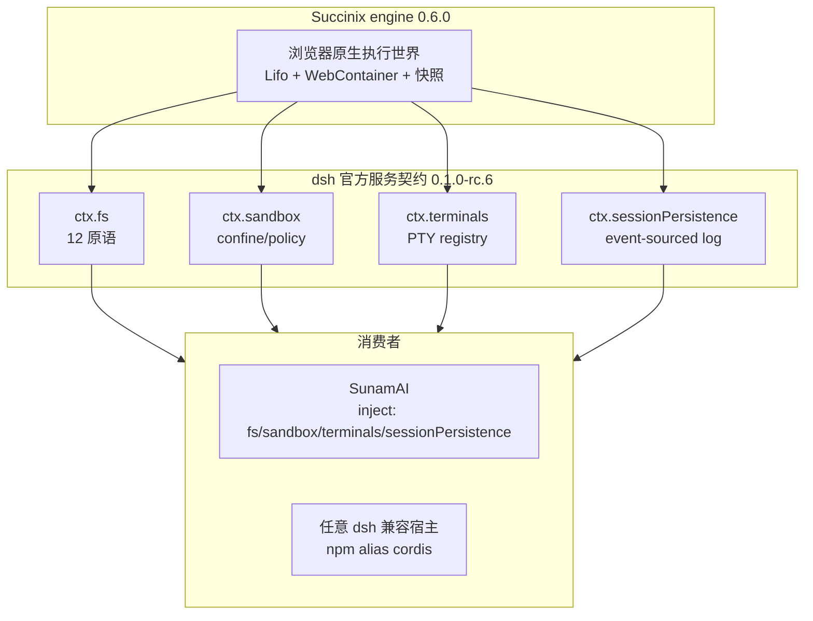

# PLAN: Succinix 全面对齐 dsh 命名空间与生态

> **Status**: 执行基线（2026-08-14 复核）
> **执行者**：AI agent（用户派 CC）+ 技术团队。审阅者：Hermes（沈知夏）。
> **历史**：`docs/PLAN-cordis.md` 为历史执行档案（当前工作区已删除，完整
> 记录在 git 历史）。
> **权威依据**：dsh 官方仓库、`docs/user/develop/framework/service.md`、
> 四个服务面 README，以及本机实测的 npm 发布物快照
> `@deepseek-ai/*@0.1.0-rc.6`（2026-08-13）。
> **修订**：2026-08-14 对照 `/tmp/dsh-cores/*-rc6/package/lib/types/*.d.ts`
> 复核：`ctx.fs` 为 **12 原语（含 `readBytes`）+ 13 错误码（含
> `FS_TOO_LARGE`）**，并补 `sandboxMode`、terminals/persistence 错误面、
> 精确旧键迁移清单与计划维护规则。

---

## 0. 本计划要点

本计划把 Succinix 从 `ctx.succinix.*` 单键服务面，迁移为 dsh 官方四服务面
`ctx.fs` / `ctx.sandbox` / `ctx.terminals` / `ctx.sessionPersistence`，并
在浏览器执行世界内明确能力边界。执行前必须固定以下决策：

1. **官方契约按 d.ts 级快照对齐，而不是 README 摘要级。**
   完整对齐 `ctx.fs` 的 12 原语（含 `readBytes`）、13 错误码（含
   `FS_TOO_LARGE`）、`sandboxMode` getter 与 `writeText` / `editText` 的
   `sandboxPolicy` 参数，并列出 `ctx.terminals` / `ctx.sessionPersistence`
   的完整方法面与错误面。
2. **`ctx.sandbox` 是 execution-world 提供者，不是 same-world 桌面后端。**
   dsh 官方的 sandbox 共享 host 内核/文件系统；Succinix 的 WebContainer +
   Lifo 是另一个执行世界。该偏差必须写进边界，并对真实 Node 子进程
   fail-closed，否则 `ctx.sandbox` 会虚报能力。
3. **`ctx.terminals` / `ctx.sessionPersistence` 不是改键名或包一层旧接口。**
   官方契约的方法面、owner 语义、事件日志模型都远大于现有
   `SuccinixTerminalService` / `PersistContext`；"复用 + 改名"会造出形状像、
   行为不像的假兼容。
4. **`ctx.fs.contains` 是纯路径关系。** 它是 canonical 身份/后代测试，不
   解析 `targetKey`，也不做权限或实例边界判定；实例/组织边界只能由
   `resolve` 与各文件操作进入时执行。
5. **`ctx.sandbox.confine` 只接受 `SandboxPolicy`。** `SandboxPolicy` 排除
   `danger-full-access`，因此 `confine` 只接受 `read-only` /
   `workspace-write`；`danger-full-access` 由 `ctx.fs` policy 与 host 执行层
   解释。任何绕过类型传入 `danger-full-access` 的调用都必须同步拒绝，不得
   裸放行。
6. **旧键门禁使用精确 token，并覆盖全部迁移面。**
   `ctx.succinixState` / `ctx.succinixPlugins` 是命令上下文字段，不是服务键，
   但会命中朴素 `grep "ctx\.succinix"`；`src/plugin/*` 的 invariant 注释也
   包含旧键。计划要求重命名这些字段并重写注释，再用 `check-dsh-keys.mjs`
   覆盖 `src/`、`tests/`、`examples/` 与 docs。
7. **迁移范围是全量，不是单 example。** 包含 `examples/cordis-app`、
   `examples/cordis-poc/main.ts`、双语 SDK/PROTOCOL/README、
   `docs/manageability.md`、`docs/cordis-poc-report.md` 与
   `examples/*/package-lock.json`。
8. **生命周期与持久化边界明确。** 页面级 HostManager 是模块单例，fiber
   reload 不得重启 host；`append` 只承诺 WebContainer 文件系统写入 +
   主动 snapshot flush，不承诺浏览器崩溃后的硬保证。
9. **S0 任务拆到可执行粒度。** 计划包含依赖表、fallback 获取契约快照的
   路径、每服务必测的错误/并发/边界清单，以及精确门禁。

---

## 1. 战略定位（一句话）

**Succinix = dsh 生态的浏览器执行世界提供者**：不再暴露 `ctx.succinix.*`
服务面，按 dsh 官方服务契约提供 `ctx.fs` / `ctx.sandbox` / `ctx.terminals` /
`ctx.sessionPersistence`。SunamAI（dsh 兼容浏览器宿主）消费这些服务，
Succinix 通过 dsh 标准命名空间进入 dsh 生态。

---

## 2. dsh 官方服务契约（0.1.0-rc.6 快照）

> 版本锁定：所有对齐键以 `0.1.0-rc.6` 为准。官方 peer 基线是
> `@deepseek-ai/cordis@4.0.1`。**S0.1 必须先把这些 d.ts 复制进仓库**
> （`docs/contracts/dsh-0.1.0-rc.6/`），不能只依赖 `/tmp/dsh-cores/`
> 这类临时目录，否则形状 diff 不可复现。

### 2.1 Succinix 应提供的服务

| dsh 官方键 | 官方定义来源 | Succinix 提供 | 实现性质 |
|---|---|---|---|
| `ctx.fs` | `@deepseek-ai/dsh-fs` | ✅ | 新实现 `FileSystem` 形状适配器 |
| `ctx.sandbox` | `@deepseek-ai/dsh-sandbox` | ✅ | execution-world confinement 适配器 |
| `ctx.terminals` | `@deepseek-ai/dsh-terminal` | ✅ | 新实现 `TerminalSessionService` 形状 + 旧终端会话后端 |
| `ctx.sessionPersistence` | `@deepseek-ai/dsh-session-persistence` | ✅ | event-sourced JSONL + 浏览器 `PersistenceBackend` |

### 2.2 `ctx.fs` 十二原语（逐条按 d.ts 对齐）

| 原语 | d.ts 签名要点 | Succinix 映射 |
|---|---|---|
| `resolve(path, opts?)` | `opts.cwd` 基址、`opts.signal` 可中止；同文件经不同路径必须同 `targetKey` | instance 路径解析；`targetKey` 用 canonical 执行世界路径 |
| `processPath(target)` | 子进程可打开的 canonical 绝对路径 | WebContainer 内 `process.cwd()` 语义的绝对路径 |
| `fileUrl(target)` | canonical `file:` URI，编码由后端负责 | 浏览器侧生成，不用 host 平台编码 |
| `contains(parent, child)` | canonical 身份/后代测试，不解析 targetKey | 纯路径关系；不执行权限或实例边界判定 |
| `stat(target, signal?)` | `FsInfo \| undefined`，只返回 version/type/size | Lifo stat；不存在返回 `undefined` |
| `lstat(path, opts?, signal?)` | `FsPathInfo \| undefined`，可报告 symlink | Lifo 无 symlink：按普通 path 元数据实现，类型永远不含 `symlink` |
| `readText(target, signal?)` | 整文件 UTF-8，NUL/二进制拒绝 | 现有 readFile + UTF-8/NUL 校验 |
| `streamText(target, signal?)` | `Promise<AsyncIterable<string>>`，跨块 UTF-8 解码 | 分块读取 + 解码器；signal 可中断 |
| `readBytes(target, signal, maxBytes)` | 完整原始字节，`maxBytes` 为包含上限，超限抛 `FS_TOO_LARGE`，不得截断返回 | 文件 RPC 读取 + 字节长度守卫 |
| `listDir(target, signal?)` | 稳定名称序，返回 `FsDirEntry[]` | 现有 listDirectory + 结构化错误码 |
| `writeText(target, content, expected?, signal?, sandboxPolicy?)` | 原子 create/replace；guard 可选；`sandboxPolicy` 按调用围栏 | 原子写 + version guard + policy 检查 |
| `editText(target, edit, expected?, signal?, sandboxPolicy?)` | 字面编辑；version guard 先于匹配；原子 critical section | 原子 edit + version guard + policy 检查 |

**必须实现的关键语义**：

- `writeText` / `editText` 的第 5 个参数 `sandboxPolicy?: SandboxExecutionPolicy`
  不是可选装饰，而是 dsh-tool-fs 在 confining backend 下会真实传入的调用参数。
  Succinix 必须在写入/编辑前执行 policy：`read-only` 直接拒绝，
  `workspace-write` 只允许 `workspaceRoot` 内，`danger-full-access` 放行。
- `createIfAbsent` 失败抛 `FS_NOT_OBSERVED`，不是 `FS_STALE_VERSION`。
- `replaceIfVersion` / edit version guard 失败抛 `FS_STALE_VERSION`。
- `editText` 多匹配（非 replaceAll）抛 `FS_AMBIGUOUS_EDIT`，无匹配抛
  `FS_EDIT_NOT_FOUND`；两者都发生在原子临界区。
- `contains` 只做 canonical 关系判断；实例/组织边界由 `resolve` 与各操作
  进入时强制执行，不得让 `contains` 越权变成策略判断。
- `workspaceRoot` / `targetKey` 统一以 canonical 执行世界路径为基准；每次
  写/编辑先 canonicalize 再 policy 检查，避免 `..` 或实例根拼接绕过。
- `streamText` 使用 `TextDecoder(..., { stream: true })` 跨块解码；signal
  触发时释放 reader 并抛 `FS_ABORTED`。
- `readBytes` 的 `signal` 是必选参数；任何已知/发现超限的目标必须抛
  `FS_TOO_LARGE`，禁止把超出 `maxBytes` 的内容截断后当作成功结果返回。
- `FileSystem.sandboxMode` getter 必须实现：返回本后端未传
  `sandboxPolicy` 时的默认变更模式，或 `undefined`（完全不默认围栏）。
  默认值由 O-10 定稿，不得遗漏该 getter。
- `fs/write-intent` / `fs/edit-intent` / `fs/observed` 由 dsh-tool-fs 与
  policy 插件在消费侧 emit / 拦截；Succinix 作为 `ctx.fs` provider 不自行
  emit，也不预挂 policy（O-12）。
- 原子写/编辑采用 per-target 互斥 + 临时文件 + rename（或等效 WebContainer
  原子替换）+ version guard；若 rename 不可用，必须保留 journal/回滚路径，
  不得出现半写可见。

### 2.3 `ctx.fs` 错误码（完整 13 码）

| 错误码 | Succinix 触发场景 |
|---|---|
| `FS_NOT_FOUND` | stat/listDir/read 等目标不存在 |
| `FS_NOT_DIRECTORY` | listDir 作用于非目录 |
| `FS_NOT_TEXT` | readText/streamText/writeText 遇二进制或 NUL |
| `FS_NOT_REGULAR_FILE` | 读/写作用于目录或 special file |
| `FS_TOO_LARGE` | readBytes/流式读取超过 `maxBytes`，或 stat 已知超限 |
| `FS_PERMISSION_DENIED` | instance 边界 / 组织隔离拒绝 |
| `FS_SANDBOX_DENIED` | sandbox policy 显式拒绝写入/编辑 |
| `FS_IO_ERROR` | 底层文件 RPC / Lifo IO 失败 |
| `FS_STALE_VERSION` | replaceIfVersion / edit version guard 不匹配 |
| `FS_NOT_OBSERVED` | createIfAbsent 时目标已存在 |
| `FS_AMBIGUOUS_EDIT` | replaceAll=false 且多个字面匹配 |
| `FS_EDIT_NOT_FOUND` | replaceAll=false 且无字面匹配 |
| `FS_ABORTED` | 调用被 AbortSignal 中止 |

错误对象形状沿用 dsh 惯例：`FsError extends HarnessError`，带稳定 `code` +
`name` + `message` + `cause?`，通过结构化错误通道暴露，不靠解析 message。

### 2.4 `ctx.sandbox` 契约与 execution-world 边界

官方 `SandboxProvider.confine(argv, policy)` 是同步方法，返回
`ConfinedArgv`（`argv` / `enforcement` / `denialSignatures` /
`runnerFailureRules`）；无法执行时抛 `SandboxUnavailableError`
（`SANDBOX_UNAVAILABLE`），绝不放行裸 argv。

词汇表：

| 类型 | 值/形状 | Succinix 语义 |
|---|---|---|
| `SandboxMode` | `read-only` / `workspace-write` / `danger-full-access` | 文件效果策略 |
| `SandboxExecutionPolicy` | mode + `workspaceRoot` + 可选 `sessionId` | 每次调用完整策略 |
| `SandboxPolicy` | 排除 `danger-full-access` 的 ExecutionPolicy | `confine` 的入参 |
| `SandboxEnforcement` | `full` / `partial` | Lifo 世界内 `full`；对真实 Node 子进程不可用 |
| `ConfinedArgv` | wrapped argv + 证据 | Lifo wrapper 命令 + Lifo 方言签名 |
| `RunnerFailureRule` | exit codes + fatalSignatures + informationalLines | Lifo runner 失败证据 |

**Succinix 边界（必须写进对外文档）**：

- dsh 官方的 sandbox 是 same-world：共享 host 内核/文件系统，用 bwrap /
  Landlock / Seatbelt / Windows ACL。Succinix **不是**这种后端，而是
  **整个执行世界的替换**。`workspaceRoot` 是 WebContainer/Lifo 世界内的
  canonical 路径，不是宿主盘路径。
- `confine` 是同步方法：不可用必须 throw，不能返回 Promise/reject。
- `confine` 只接受 `SandboxPolicy`（`read-only` / `workspace-write`）；
  `danger-full-access` 不是合法入参。`node|npm|npx` 在受限模式下同步抛
  `SandboxUnavailableError`；任何绕过类型传入 `danger-full-access` 的调用
  同样拒绝，不返回裸 argv。
- `enforcement` 只在 Lifo 世界内报告 `full`；它不声称限制宿主系统、
  host 文件系统或 WebContainer 外的资源。`denialSignatures` /
  `runnerFailureRules` 使用 Lifo/WebContainer 自己的方言，不复用桌面后端
  的 EROFS/EACCES/EPERM 清单。
- wrapper 只约束顶层 argv；shell 脚本内部的嵌套 `node` 调用无法被进程围栏
  审计。任何 wrapped argv 都不得被描述为安全边界。
- 不引入假 `chmod`、假权限位。`FS_PERMISSION_DENIED` 只表示实例/组织边界
  或策略拒绝。

### 2.5 `ctx.terminals` 完整契约（不是 `create(output)` 改名）

官方 `TerminalSessionService` 的方法面：

| 方法 | 语义 | Succinix 适配 |
|---|---|---|
| `registerBackend(backend)` | 注册一个 `type` | 注册 `type: 'succinix'` 后端 |
| `listBackends()` | 列出已注册 type | 同左 |
| `spawn(owner, request, signal?)` | 创建并发布 session id | 映射到旧终端会话创建；`owner` 为 dsh `Agent` |
| `hasOwnerActivity(owner)` | spawn 到 close 全程可查 | 用 session registry 状态实现 |
| `startSend(owner, id, request)` | 一次排他 send | 映射到 `session.handleData` / send 队列 |
| `read(owner, id, request?)` | 有界 scrollback 分页 | 读取终端滚动缓存 |
| `signal(owner, id, signal)` | 允许的 POSIX signal | 映射到 Ctrl+C / interrupt 能力 |
| `kill(owner, id, reason?)` | 关闭并等待后端 quiescent | 映射到会话 close + 进程树等待 |
| `list(owner)` | 该 owner 可见的 session snapshots | 按 owner 过滤的 snapshot 列表 |

边界：

- `ctx.terminals` 需要 `Agent` owner 类型，owner 由 SunamAI 的
  `ctx.agents` 提供；Succinix 不实现、不拥有 `ctx.agents`。
- owner 是 opaque 引用，不设隐式 `guest` 兜底；宿主未提供 owner 时
  `spawn` / `list` / `read` 等必须按 vendored d.ts 的失败语义 fail-closed，
  不得伪造 owner。
- 会话是 process-local 的，host 重启不恢复——与官方 dsh-terminal 一致。
- `startSend` 每个 session 同一时刻最多一个 in-flight send；并发 send 按
  d.ts 的排他语义排队或拒绝，`kill` 必须 drain 未完成 send 并等待进程树
  quiescent，超时后以结构化错误关闭。
- `list` / `hasOwnerActivity` 只返回该 owner 可见会话；跨 owner 访问拒绝。
- 旧 `SuccinixTerminalSession`（history、tab complete、command queue、
  Ctrl+C、cwd prompt）继续作为后端实现存在，不作为 `ctx.terminals` 的
  唯一形状。

官方错误面（8 个 `TerminalErrorCode`，S0.6 必须逐码有测试）：

| 错误码 | 触发场景 |
|---|---|
| `DUPLICATE_BACKEND` | 同一 `type` 重复注册 |
| `DUPLICATE_NAME` | 同一 owner 下 name 已存在或正在创建 |
| `FOREIGN_SESSION` | 对非本 owner 的 session 执行操作 |
| `NO_BACKEND` | `spawn` 请求未注册的 `type` |
| `NO_SESSION` | 操作不存在的 session id |
| `OWNER_NOT_LIVE` | owner 未注册或已被 dispose |
| `SEND_ACTIVE` | session 已有 in-flight send 时再次 `startSend` |
| `SERVICE_DISPOSING` | 服务 disposal 期间调用 `spawn` |

此外 `TerminalBackendCleanupError`（`spawnError` + `cleanupError`）表示
后端启动与清理都失败；`spawn` 发布前回滚时若 session close 也失败，按官方
实现抛 `AggregateError`，不得吞掉清理失败。

### 2.6 `ctx.sessionPersistence` 完整契约（不是 `snapshot.save` 改名）

官方抽象服务方法面：

| 方法 | 语义 | Succinix 适配 |
|---|---|---|
| `locate(meta)` | 返回 per-session artifact 位置或 `undefined` | JSONL 状态根路径 |
| `supportsRawArtifacts` | 是否暴露逐 session 原始 artifact | `true` |
| `readRaw(id, signal?)` | 读取后端原始 artifact 文本，返回 `{ meta, filename, content }` | 按 JSONL 文件读取 |
| `create(meta)` | 注册 metadata，可 lazy materialize | 写 header / 延后建文件 |
| `append(id, events)` | append-only 持久化 batch | 追加 JSONL + 持久化 flush |
| `prepare(id, signal?)` | 保留 unpublished Session | 走 coordinator（官方或镜像） |
| `load(id)` | 平衡逻辑日志 + crash repair | 冷/热加载语义 |
| `inspect(id, signal?)` | 不可变检查，不 commit repair | 同左 |
| `readFrom(id, fromSeq, signal?)` | 从 seq 后缀读取 | JSONL 顺序解析后 skip |
| `list(signal?)` | metadata 轻量列表 | 读取状态根 |
| `listSnapshots(signal?)` | metadata + opaque revision | 用文件 mtime/内容 hash |

边界与修正：

- Succinix 现有 snapshot / tinbase 持久化是内部机制，**不能**直接改名为
  `ctx.sessionPersistence`。官方契约以 `SessionEvent` / `SessionHeader` /
  `SessionPreparation` 的事件日志为单一事实源。
- 推荐路径：若 O-7 允许依赖官方 `@deepseek-ai/dsh-session-persistence`，
  复用 `PersistenceCoordinator`，只实现浏览器 `PersistenceBackend` hooks
  （`loadStored` / `appendBatch` / `commitRepair` / `list` / `close?`）。
  （上游 `cordis` 平行路径**已否决**——2026-08-13 用户拍板：两边计划一律对齐 dsh 官方 `@deepseek-ai/cordis@4.0.1`，不实现镜像）
- durability 边界：`append` 能保证的是 WebContainer 文件系统写入 + 主动
  snapshot flush，不是浏览器崩溃后的硬保证；对外文档必须写明
  "durable in the browser execution world, best-effort across page reload"。
- `list()` 当前无分页、无过滤；在 S0 阶段接受官方限制，不额外发明分页 API。
- JSONL 必须 header 在前、`seq` 连续、事件 JSON 可序列化；单条未完整写入
  不得视为已提交事件。
- `load` 的 crash repair 只允许截断尾部残缺/损坏行，不重写、不补造事件；
  `inspect` 是不可变检查，不 commit repair。`listSnapshots` 只读，不得因
  读取而改写 mtime/内容。
- `locate` 返回执行世界内 instance 状态根下的路径，不暴露宿主盘路径。
- `append` 在每次 batch 完成 WebContainer 文件系统写入后 resolve；snapshot
  flush 可异步调度，但 `append` 自身不等同于快照完成。

官方错误/值面（S0.7 必须对齐）：

- `SessionPersistenceCorruptionError`：后端读取成功后，已提交前缀校验失败。
- `SessionFormatUnsupportedError`：日志完整但格式版本不支持 / 出现未知必需
  事件类型；带可选 `location` 指向原始 artifact，错误文案必须区分"升级
  harness"与"损坏"。
- `SessionPersistenceRevision` 是 opaque branded token：`listSnapshots` /
  `readStoredRevision` / `StoredPrefix.revision` 必须同源同表示，读取不得
  改写 mtime/内容。
- `PersistenceCoordinator` 的 backend hooks 为 `loadStored` /
  `readStoredRevision` / `loadStoredFrom?` / `appendBatch` / `commitRepair` /
  `list` / `locate?` / `close?`；`appendBatch` 的 materialize-write 与首
  batch 必须原子提交。

### 2.7 dsh 其余服务（Succinix 不提供）

`ctx.tools` / `ctx.llm` / `ctx.agents` / `ctx.systemPrompt` /
`ctx.approval` / `ctx.invariants` / `ctx.session` 等由 SunamAI 宿主提供。
Succinix 只提供浏览器原生四服务面，并消费 host 提供的 owner / session /
policy 类型。

---

## 3. 现状基线（0.5.0 实测）

- 当前唯一服务键是 `ctx.succinix`；`src/plugin/index.ts:17` 执行
  `ctx.provide('succinix', service)`。
- `src/plugin/services.ts` 是 446 行聚合服务，包含 executor / terminal /
  snapshot / persist / workspace / ports / services / capabilities /
  lifecycle / events。
- 旧键字面量（`rg -o "ctx\.succinix"`，2026-08-14，排除本计划）：
  `src/` **13** 处（`src/commands/manage.ts` 5、`src/host/plugins/container.ts`
  2、`src/plugin/*` 6：types/ports/services/services-service/executor-runtime/
  service-runtime 各 1）。
- `tests/plugin-c1..c4.test.ts` 内 `ctx.succinix` 出现 **140** 处
  （c1=5、c2=97、c3=4、c4=34）。历史草案写的"95+34"不准确。
- `src/commands/manage.ts` 另有 `ctx.succinixState` /
  `ctx.succinixPlugins` 两个命令上下文字段，不是服务键，但会命中朴素 grep；
  S0.8 必须一并重命名。
- `examples/cordis-app` **61** 处（`src/contract.ts` 60、`src/migration.ts`
  1）、`examples/cordis-poc/main.ts` 1 处旧键。
- 含 `ctx.succinix` 字面量的文档面（排除本计划）共 **12 个文件 / 137 处**：
  `README.md`（14）、`docs/FEATURES.md`（5）、`docs/FEATURES.zh-CN.md`（5）、
  `docs/MIGRATION.md`（25）、`docs/PLUGIN.md`（17）、`docs/PROTOCOL.md`（2）、
  `docs/PROTOCOL.zh-CN.md`（2）、`docs/README.zh-CN.md`（14）、
  `docs/SDK.md`（23）、`docs/SDK.zh-CN.md`（23）、`docs/manageability.md`
  （5）、`docs/replay-support.md`（2）。
- 无字面旧键但必须随迁移重写的服务契约/README/版本门共 **5 类（7 个实际
  文件）**：`docs/cordis-contract.md`、`docs/cordis-poc-report.md`、
  `packages/engine/README.md`、`examples/cordis-app/README.md`、
  `examples/cordis-app/package.json` + `package-lock.json` +
  `scripts/prepare-assets.mjs`（版本门/描述仍指向 0.5.0 /
  `inject: ['succinix']`）。
- 底层引擎（Lifo / WebContainer / 文件 RPC / 端口 / 进程 / 快照）可用；
  **不重写协议**，只重构服务注册层与适配层。
- `/tmp/dsh-cores/dsh-fs-rc6` 等四份 dsh 发布物快照存在，但不在仓库内，
  不可作为长期权威来源。
- `docs/contracts/` 当前不存在；S0.1 必须新建并入库，不能只依赖 `/tmp`。
- `scripts/check-docs.mjs` 目前跳过所有 `PLAN-*`，本计划内的未来路径不会
  触发 docs 检查；迁移完成后应归档或删减本计划，避免未验证引用进入长期
  文档基线。

---

## 4. 命名空间映射表（0.5.0 自研 → dsh 官方）

| Succinix 0.5.0 现状 | dsh 官方键 | 动作 |
|---|---|---|
| `ctx.succinix.executor`（exec/spawn/ps/kill） | `ctx.sandbox.confine` + `ctx.fs.processPath` | 重构：命令面只剩 confine 包装；进程管理留在内部 |
| `ctx.succinix.terminal.create(output)` | `ctx.terminals` | 重构：官方 registry 形状 + 旧会话后端 |
| `ctx.succinix.snapshot` / `persist` | `ctx.sessionPersistence` | 重构：event-sourced adapter |
| `ctx.succinix.workspace` | `ctx.fs.resolve/contains` + host workspace | 拆解，不提供 `ctx.workspace` |
| `ctx.succinix.ports` | host preview / ports | 移交 SunamAI；内部事件可保留 |
| `ctx.succinix.services` | host 管理面 | 移交 host app，不是 dsh 服务 |
| `ctx.succinix.capabilities` | sandbox policy / host approval | 拆入 policy；不提供 `ctx.capabilities` |
| `ctx.succinix.instance` / `container` | host session / container | 移交 host；生命周期走 O-8 定义的手持 seam |
| `ctx.succinix.boot/attach/ensureInstance` | host lifecycle | 不再作为 `ctx.succinix` 服务面 |
| `ctx.succinix`（整体） | **消灭** | 重命名 `succinixState` / `succinixPlugins` 后，`check-dsh-keys.mjs` 扫描 `src/ tests/ examples/` = 0 |

---

## 5. 明确边界（写进对外文档）

### 5.1 提供

- dsh 四服务面：`ctx.fs`（12 原语 + 13 错误码 + `sandboxMode`）、`ctx.sandbox`（confine +
  fail-closed）、`ctx.terminals`（owner-scoped registry）、
  `ctx.sessionPersistence`（event-sourced JSONL）。
- 浏览器原生能力：真实 Node 子进程（`node|npm|npx`）、Lifo 用户态、
  Pyodide Python、快照/持久化、端口预览、共享页面 host。

### 5.2 不提供 / 不承诺

- 不提供 dsh 桌面 sandbox 后端（bwrap / Landlock / Seatbelt / Windows ACL）。
  Succinix 是 execution-world 替换，不是 same-world 后端。
- 不为 `node|npm|npx` 提供 `read-only` / `workspace-write` 的 per-call
  文件围栏；`confine` 对这两种模式 fail-closed。
- 不提供 `chmod` 语义、真实 permission bits、真实内核、apt/native binaries、
  入站外网、交互式 stdin REPL、symlink/hard link、Firefox/Safari/mobile。
- 不提供 `ctx.tools` / `ctx.llm` / `ctx.agents` 等宿主服务。
- 不做内存/CPU 精确统计；估算值必须带 `~` 和 `(estimated ...)` 脚注。
- 多实例/用户隔离只是组织隔离，不是安全边界。
- 页面级 HostManager 是模块单例；fiber reload 不得重启 host，
  `shutdown()` / page unload 是唯一硬 teardown 入口。
- `ctx.terminals` 不设隐式 owner；宿主未提供 `Agent` 时服务 fail-closed。
- 四服务键只在方法面完整时提供，不发布占位/半截服务。
- wrapper 不构成安全边界；嵌套命令、WebContainer 外资源、宿主文件系统均
  不在承诺范围内。
- Succinix 自带 app 的 UI 保持 English-only、无 emoji；结构化错误可向宿主
  暴露，但终端/UI 文本沿用 ASCII 状态标记。
- 不维护 `ctx.succinix` 与 dsh 键的双轨长期共存；0.6.0 直接移除旧键。

### 5.3 版本锁定与协议

- dsh 对齐键以 `0.1.0-rc.6` 快照为准；官方 breaking change 时先更新
  vendored d.ts，再更新 shape diff。
- `docs/contracts/dsh-0.1.0-rc.6/` 附带 `SOURCES.md`：记录每个包的 tarball
  来源、版本、`dist.integrity` 与复制文件清单；若 `/tmp/dsh-cores` 丢失，
  按同一版本重新 `npm pack` 并校验，不换版本。
- 文件 RPC 仍为 `/cmd.json` → `/result-<id>.json`，一个请求一个独立结果文件。
- `node|npm|npx` → 真实 Node 子进程；其余 → Lifo；该路由不变。
- dev server 仍为 Vite `localhost:7892` + COOP/COEP。
- tinbase 仍 `--engine wasm`，不带 `--memory`；install timeout 不变。
- 触碰 `src/engine/host/`、`src/engine/host-procs.ts`、
  `src/engine/lifo-core.ts` 后必须 `node scripts/build-host.mjs`。
- 触碰 `src/plugin/` 后必须 `node scripts/build-engine-package.mjs`。
- `check-dsh-shapes.mjs` 与 `check-dsh-keys.mjs` 并入 `npm run check`。

---

## 6. 技术债务清单（本次计划必须偿还）

| # | 债务 | 现状 | S0/S3 处置 |
|---|---|---|---|
| TD-1 | `ctx.succinix` 服务面 | `src/` 13 处、`tests/` 140 处 | 全部迁移/删除 |
| TD-2 | 服务聚合单体 | `src/plugin/services.ts` 446 行 | 拆成 fs/sandbox/terminals/persistence + lifecycle |
| TD-3 | 官方契约只存在于 `/tmp` | `/tmp/dsh-cores/*` 临时快照；`docs/contracts/` 不存在 | vendored `docs/contracts/dsh-0.1.0-rc.6/` |
| TD-4 | dsh-fs 错误码/参数缺失 | 此前计划只列 7 码 | 按 d.ts 补 13 码 + `sandboxPolicy` |
| TD-5 | `ctx.terminals` 形状不匹配 | 只有 `create(output)` | 官方 registry 形状 + 后端适配 |
| TD-6 | `ctx.sessionPersistence` 形状不匹配 | 只有 snapshot/persist | event-sourced JSONL adapter |
| TD-7 | sandbox same-world 语义误用 | 计划声称"同契约不同实现" | execution-world 边界 + node fail-closed |
| TD-8 | deprecation 与 grep-0 矛盾 | O-4 建议 0.6.0 保留旧键 | 定稿：0.6.0 直接移除，无双轨 |
| TD-9 | 文档全面过期 | SDK/PLUGIN/MIGRATION/cordis-contract/FEATURES/PROTOCOL/README/replay-support 仍写 `ctx.succinix` | S0.9/S3 同步更新 |
| TD-10 | example 版本硬编码 | `prepare-assets.mjs` 只接受 `0.5.` | 0.6.0 后更新版本门 |
| TD-11 | 根包版本漂移 | 根 `package.json` 0.4.0，engine 0.5.0 | 发布前核对/统一版本口径 |
| TD-12 | docs allowlist 残留 | `check-docs.mjs` ALLOW_NON_REPO 含 `succinix/*` 事件 | 文档迁移后清理 |
| TD-13 | 缺少 dsh 形状门禁 | 只有手工比对 | `scripts/check-dsh-shapes.mjs` 入 `npm run check` |
| TD-14 | 生命周期手持有缺口 | 删除 `ctx.succinix` 后没有公开 attach/boot 面 | O-8 定义 host seam，不能留空洞 |
| TD-15 | 旧键 grep 假阳性 | `ctx.succinixState` / `ctx.succinixPlugins` 与 invariant 注释命中朴素 grep | S0.8/S0.9 重命名并重写注释；新增精确 token 检查 |
| TD-16 | example/POC 迁移遗漏 | `examples/cordis-poc/main.ts`、`docs/cordis-poc-report.md` 仍是旧键 | S0.9 全量迁移，纳入 `check-dsh-keys.mjs` 范围 |
| TD-17 | 双语/管理面文档遗漏 | SDK.zh-CN / PROTOCOL.zh-CN / README.zh-CN / manageability 未列迁移清单 | S0.9 按 `rg -l` 清单全量迁移 |
| TD-18 | O-7 已定稿：peer/依赖切换 | engine peerDeps 仍 `cordis >=4.0.0-rc.8`（上游），demo lock 含 0.5.0 | **S0.2 切换为 `@deepseek-ai/cordis@4.0.1`** + 更新 lock；S3.1 干净安装验证 |

---

## 7. 里程碑与门禁

### S0：引擎服务面重构（预计 3 周，核心是适配器而非改名）

- 实现四服务面 + 生命周期 host seam。
- 删除 `ctx.succinix`，迁移 `src/`、`tests/`、app、docs、example。
- 新增 dsh 形状 diff 门禁。
- **门禁**：`check-dsh-keys.mjs`（`src/ tests/ examples/` 精确 token）= 0；
  `npm run check` 全绿（含新增 shape 检查）；
  `node scripts/cordis-app-e2e.mjs` 以 dsh 键跑通浏览器契约。

### S1：SunamAI / Succinix app 消费方迁移（预计 1 周，与 S0.7 后可并行）

- SunamAI 插件 `inject: ['succinix']` → 四 dsh 键；生命周期改用 O-8 的
  host seam。
- Succinix 自带 app（`src/host/`）同步迁移。
- **门禁**：SunamAI `check:all` 全绿；`localhost:7892` 浏览器 smoke 全绿。

### S2：dsh 生态互测（预计 1 周）

- 在 SunamAI 中跑 dsh 官方工具插件 `dsh-tool-fs` / `dsh-tool-bash`，
  消费 Succinix 的 `ctx.fs` / `ctx.sandbox`。
- 验证 write/edit 的 `sandboxPolicy`、错误码、fail-closed。
- **门禁**：dsh-tool-fs 真实读写/编辑通过；dsh-tool-bash 在
  `read-only` / `workspace-write` 下行为符合 policy；
  `node|npm|npx` 的受限模式抛 `SANDBOX_UNAVAILABLE`。

### S3：0.6.0 发布（预计 1 周）

- 版本 0.6.0（breaking：删除 `ctx.succinix`）。
- CHANGELOG + 迁移文档 + tag + npm pack/publish（发布动作由 release owner
  执行）。
- 形状 diff 测试、docs 完整性、engine package 完整性进 CI。
- **门禁**：干净安装验证 + SunamAI 消费正常 + `npm run check:e2e` 全绿。

---

## 8. 待调研决策点（O 系列）

| # | 决策点 | 候选 | 建议 |
|---|---|---|---|
| O-1 | `ctx.fs` 实现顺序 | 先 6 高频 vs 全量一次 | 按 6 高频开始写，但 **S0 结束前必须 12 原语全量**，不发布半截服务 |
| O-2 | `ctx.sandbox` execution-world 偏差 | 接受并文档化 vs 不提供 `ctx.sandbox` | 接受并文档化；`confine` 只处理两种受限模式，node/npm/npx fail-closed，`danger-full-access` 由 fs/host 层解释 |
| O-3 | `ctx.terminals` 实现方式 | 自实现官方形状 vs 依赖官方包 | 先自实现镜像；O-7 通过后评估换官方 registry |
| O-4 | deprecate 窗口 | 0.6.0 保留旧键 + 0.7.0 删 vs 0.6.0 直接删 | **定稿：0.6.0 直接删**，单轨不维护双命名空间 |
| O-5 | 形状 diff 测试 | 自研脚本 + vendored d.ts vs 装官方包 | 自研 + vendored d.ts，避免 peer 图污染 |
| O-6 | `ctx.sessionPersistence` 后端 | 官方 `PersistenceCoordinator` + 浏览器 backend vs 自实现 JSONL 镜像 | O-7 允许官方依赖时选官方；否则自实现同不变量镜像 |
| O-7 | Cordis 基线 | 上游 `cordis` vs `@deepseek-ai/cordis` fork | **已定稿（2026-08-13 用户拍板）：`@deepseek-ai/cordis@4.0.1`**，与 dsh 官方完全对齐，不维护上游平行基线；S0.2 更新 engine peerDeps + lock |
| O-8 | 容器生命周期 handoff | SunamAI 提供 `ctx.webcontainer` host seam vs 仅 internal boot vs 隐藏 `ctx.succinix` bootstrap | SunamAI host seam（推荐）；internal boot 兜底；隐藏旧键否决 |
| O-9 | ports/services/capabilities 去向 | SunamAI host services vs app 内部服务 | SunamAI 侧 host services；不占 dsh 键 |
| O-10 | `ctx.fs.sandboxMode` 默认口径 | `workspace-write` vs `undefined` | `workspace-write`：浏览器执行世界默认落 workspace 根，未传 `sandboxPolicy` 时仍受限；若返回非 `undefined`，dsh-tool-fs 要求宿主同时提供 `ctx.sandboxPolicy`；S0.4 前定稿 |
| O-11 | `ctx.terminals` 的 `Agent` 类型来源 | 依赖 `@deepseek-ai/dsh-agent` vs vendored 结构类型 | vendored 最小结构类型，避免 peer 图污染；O-7 定稿后可换官方类型；S0.6 前定稿 |
| O-12 | `fs/*` 事件责任 | provider 不 emit vs 预挂 policy 拦截 | `ctx.fs` 只提供服务与类型；`fs/observed` 由 `dsh-tool-fs` 在成功读写编辑后 emit，`fs/write-intent` / `fs/edit-intent` 由 policy 插件/宿主挂载；Succinix 不预装；S0.4 前定稿 |

决策纪律：O-7 / O-8 必须在 S0.3 类型定义前定稿；O-10 / O-12 在 S0.4 前、
O-11 在 S0.6 前定稿；其余不阻塞早期 fs 实现。

---

## 9. S0 执行规格（任务级 WBS）

> 写 TASK 时先读 `docs/contracts/dsh-0.1.0-rc.6/` 下 vendored d.ts，
> 再对照 §2 各节；禁止凭 README 摘要猜形状。

### S0 依赖顺序与任务表

| Task | 依赖 | 产出 | 关键门禁 |
|---|---|---|---|
| S0.0 | 无 | baseline 记录：`npm run check` 全绿、旧键计数入档、git 基线 | `npm run check` 全绿；§3 数字与实测一致 |
| S0.1 | 无 | vendored d.ts + `SOURCES.md` + peer graph | `check-dsh-shapes.mjs` 可读四份契约 |
| S0.2 | S0.1 | O-7/O-8 决策记录 | 无未决阻塞项 |
| S0.3 | S0.1 + S0.2 | `src/plugin/dsh-types.ts` | typecheck + shape diff 0 缺失 |
| S0.4 | S0.3 | `fs-service.ts` + `fs-mutations.ts` + 测试 | 单测 + shape + audit:files |
| S0.5 | S0.3 | `sandbox-service.ts` + 测试 | 单测 + build:host + shape |
| S0.6 | S0.3 | `terminal-service.ts` + `terminal-backend.ts` + 测试 | 单测 + shape |
| S0.7 | S0.3 + O-6 | `persistence-service.ts` + 测试 | 单测 + shape |
| S0.8 | S0.4..S0.7 | 插件入口 + lifecycle host seam | `check-dsh-keys` 0 + boundaries + engine package |
| S0.9 | S0.8 | tests/app/docs/examples 全量迁移 | `npm run check` 全绿 + e2e |

### S0.1 固化官方契约快照

- 从 `/tmp/dsh-cores/dsh-fs-rc6/package/lib/types/`、
  `/tmp/dsh-cores/dsh-sandbox-rc6/package/lib/types/`、
  `/tmp/dsh-cores/dsh-terminal-rc6/package/lib/types/`、
  `/tmp/dsh-cores/dsh-session-persistence-rc6/package/lib/types/`
  复制 d.ts 到 `docs/contracts/dsh-0.1.0-rc.6/`，附 MIT attribution 与
  来源 README 版本号。
- 若 `/tmp/dsh-cores` 不存在，用 `npm pack` 重新获取同一版本，记录 tarball
  的 `dist.integrity`，并写入 `docs/contracts/dsh-0.1.0-rc.6/SOURCES.md`。
- 记录 peer graph：`@deepseek-ai/cordis@4.0.1` 与四服务包的 peer 依赖。
- vendored 目录按包分目录入库：`dsh-fs/{index,types,invariant}.d.ts`、
  `dsh-sandbox/{index,escalation,roots,invariant}.d.ts`、
  `dsh-terminal/{index,types,invariant}.d.ts`、
  `dsh-session-persistence/{index,coordinator,revision,write-behind,
  preparations,invariant}.d.ts`；每个包附 README 版本号与 LICENSE 署名。
- **新建 `scripts/check-dsh-shapes.mjs`（基础模式：读取 vendored 契约路径
  并列出四份 d.ts 的方法/错误码清单；`--types` 逐项可赋值性比较模式由
  S0.3 增加）与 `scripts/check-dsh-keys.mjs`（精确旧键 token：
  `ctx.succinix` / `ctx.succinixState` / `ctx.succinixPlugins`，覆盖
  src/tests/examples/docs，本计划白名单；S0.8 清零门禁用）**——两个脚本
  当前不存在，是 S0.1 的产出之一，不能只引用不创建。
- 门禁：`node scripts/check-dsh-shapes.mjs` 能读取 vendored 路径；
  `npm run check:docs` 全绿。

### S0.2 定稿 O-7 / O-8

- 与 SunamAI 确认 Cordis 基线与 WebContainer handoff 服务键。
- 输出决策记录到本计划 §8 和 `docs/SDK.md`。
- 同步决定 `packages/engine` peerDependencies 的包名/版本、demo lockfile
  更新方式，以及 lifecycle seam 的精确方法面。
- 门禁：无未决 O-7/O-8 阻塞项。

### S0.3 定义 dsh 形状类型

- 新增 `src/plugin/dsh-types.ts`：`FsTarget` / `FsInfo` / `FsPathInfo` /
  `FsDirEntry` / `FsWriteIntent` / `FsWriteOutcome` / `FsEditRequest` /
  `FsEditOutcome` / `FsObservation` / `FsVersion` / `FsTargetKey` /
  13 个 `FsErrorCode` + `FsError` + `readBytes` 相关签名 +
  `FileSystem.sandboxMode` 类型；`SandboxMode` / `ConfinedSandboxMode` /
  `SandboxExecutionPolicy` / `SandboxPolicy` / `SandboxEnforcement` /
  `ConfinedArgv` / `RunnerFailureRule` / `SandboxUnavailableError`；
  `TerminalSessionService` 方法面 + 8 个 `TerminalErrorCode` +
  `TerminalBackendCleanupError`；`SessionPersistence` 方法面 +
  `SessionPersistenceCorruptionError` / `SessionFormatUnsupportedError` /
  `SessionRawArtifact`；按 O-11 提供 vendored `Agent` 结构类型（O-7 后按
  官方包类型或镜像）。
- 所有新文件带 invariant 标记，满足 `check-plugin-boundaries.mjs`。
- `scripts/check-dsh-shapes.mjs` 增加 `--types` 模式：逐项比较 vendored
  d.ts 与本仓类型的可赋值性，禁止手工补字段。
- 门禁：`tsc -p tsconfig.json --noEmit` 0 错；shape diff 0 缺失。

### S0.4 实现 `ctx.fs`

- 新增 `src/plugin/fs-service.ts`（12 原语）与
  `src/plugin/fs-mutations.ts`（per-target lock、atomic write/edit、
  version guard）。
- 复用 `src/engine/` + `src/instance/` 现有文件能力；不改变
  `/cmd.json` / `/result-<id>.json` 协议。
- `writeText` / `editText` 支持 `sandboxPolicy`，policy 拒绝抛
  `FS_SANDBOX_DENIED`。
- 实现顺序：纯路径原语（resolve/processPath/fileUrl/contains）→ 只读原语
  （stat/lstat/readText/streamText/readBytes/listDir）→ 写/编辑原子原语 →
  `sandboxPolicy` 围栏与 `sandboxMode` getter。
- 按 O-12 不预挂 `fs/write-intent` / `fs/edit-intent`，provider 不自行 emit
  `fs/observed`；事件词汇与类型只随 vendored d.ts 暴露给 SunamAI 侧工具层。
- 新增 `tests/fs-service.test.ts`、`tests/fs-mutations.test.ts`：
  12 原语、13 错误码、`readBytes` 超限、`sandboxMode` 默认值、`contains`
  纯路径语义、canonicalization/`..`、并发写、edit 歧义、abort、policy
  拒绝、`FS_NOT_OBSERVED` / `FS_STALE_VERSION` / `FS_AMBIGUOUS_EDIT` /
  `FS_TOO_LARGE`。
- 门禁：单测全绿；shape diff 0 缺失；`npm run audit:files` 不超限。

### S0.5 实现 `ctx.sandbox`

- 新增 `src/plugin/sandbox-service.ts`：同步 `confine(argv, policy)`。
- Lifo 命令：返回 `['succinix-sandbox', '--mode', mode, '--workspace',
  root, ...argv]` 形状的 wrapper（具体 host 命令名以实现为准），
  `enforcement: 'full'`，返回 Lifo 方言的 denial/runner 证据。
- `node|npm|npx` + 受限 mode：抛 `SandboxUnavailableError`。
- `confine` 必须同步 throw；若 host wrapper 命令不存在或 host 未就绪，
  一律 `SANDBOX_UNAVAILABLE`，不返回降级 argv。
- `SandboxUnavailableError` 走 `HarnessError` 结构化通道：`name` + `code:
  'SANDBOX_UNAVAILABLE'` + `message`，不得用裸字符串错误替代。
- 若需要在 host daemon 增加 wrapper，则同时改
  `src/engine/host/`，并执行 `node scripts/build-host.mjs`。
- 新增 `tests/sandbox-service.test.ts`：两种受限模式、`danger-full-access`
  运行时拒绝、node fail-closed、argv 包装形状、runner 证据。
- 门禁：单测全绿；`npm run build:host` 成功；shape diff 0 缺失。

### S0.6 实现 `ctx.terminals`

- 新增 `src/plugin/terminal-service.ts`（registry 形状）与
  `src/plugin/terminal-backend.ts`（包装现有
  `SuccinixTerminalSession`）。
- `spawn` / `startSend` / `read` / `signal` / `kill` / `list` /
  `hasOwnerActivity` 行为对齐官方 d.ts；owner 引用 SunamAI `Agent` 类型。
- 新增 `tests/terminal-service.test.ts`：owner fencing、send 排他、
  owner 缺失 fail-closed、并发 send、kill quiescence/超时、无发布间隙。
  同时覆盖 8 个 `TerminalErrorCode` 与 `TerminalBackendCleanupError`
  （spawn 启动+清理双失败路径）。
- 门禁：单测全绿；shape diff 0 缺失。

### S0.7 实现 `ctx.sessionPersistence`

- O-6 定稿后二选一：官方 `PersistenceCoordinator` + 浏览器
  `PersistenceBackend`，或同不变量镜像。
- 事件日志为 per-session JSONL，位于 instance 状态根；
  `locate` 返回 `{ kind: 'jsonl', path }`；
  `supportsRawArtifacts: true`。
- 对齐 `SessionPersistenceCorruptionError` / `SessionFormatUnsupportedError`
  / `SessionRawArtifact` / `SessionPersistenceRevision` 的 shape 与语义。
- 新增 `tests/persistence-service.test.ts`：append-only、contiguous seq、
  JSON 可序列化、load repair 只截尾、inspect 不 commit、readFrom、
  listSnapshots 只读 revision、locate 路径边界、损坏/未知格式拒绝、
  readRaw verbatim、coordinator materialize+首 batch 原子性。
- 门禁：单测全绿；未通过全部方法行为前不宣称提供该服务。

### S0.8 插件入口与服务拆分

- `src/plugin/index.ts` 改为提供四个 dsh 键；删除
  `ctx.provide('succinix', service)`。
- 拆分 `src/plugin/services.ts`；删除/迁移 ports、services、capabilities、
  workspace 等非 dsh 服务面；生命周期走 O-8 host seam。
- 内部 `succinix/*` 事件可保留给 app 可观测性，但不得再通过
  `ctx.succinix.on*` 暴露。
- 重命名 `src/commands/manage.ts` / `src/commands/types.ts` 中的
  `ctx.succinixState` / `ctx.succinixPlugins`，并重写 `src/plugin/*`
  invariant 注释中的旧键文本。
- 门禁：`check-dsh-keys.mjs src tests` = 0；
  `npm run check:plugin-boundaries` 全绿；
  `npm run build:engine-package` 成功。

### S0.9 测试、app、docs、example 全量迁移

- 迁移 `tests/plugin-c1..c4.test.ts` 的 140 处旧键；迁移 `src/host/`、
  `src/commands/` 的 13 处旧键。
- 更新 `examples/cordis-app/src/contract.ts` 与 `migration.ts` 为 dsh 键；
  迁移 `examples/cordis-poc/main.ts`；更新两个 example 的 README /
  package-lock，以及 `prepare-assets.mjs` 版本门。
- 按 §3 的 12 个含字面旧键文档文件全量迁移，并重写 5 类（7 个实际文件）
  无字面量但记录服务契约/版本门的文件：`docs/cordis-contract.md`、
  `docs/cordis-poc-report.md`、`packages/engine/README.md`、
  `examples/cordis-app/README.md`、`examples/cordis-app/package.json` +
  `package-lock.json` + `scripts/prepare-assets.mjs`。
- 清理 `scripts/check-docs.mjs` 中不再需要的 `succinix/*` allowlist。
- `package.json` 增加 `check:dsh-shapes` / `check:dsh-keys` 两个 script，
  并并入 `npm run check`；`scripts/check-dsh-shapes.mjs` 与
  `scripts/check-dsh-keys.mjs` 在 S0.1 已创建，本步只完成接线与清零。
- 门禁：`check-dsh-keys.mjs src tests examples` = 0；
  `rg -l "ctx\.succinix" README.md docs packages/engine/README.md examples`
  只剩本计划（或归档）；
  `npm run check` 全绿；`node scripts/cordis-app-e2e.mjs` 全绿。

---

## 10. S1/S2/S3 执行规格

### S1.1 SunamAI 消费方迁移

- `inject: ['succinix']` → `inject: ['fs', 'sandbox', 'terminals',
  'sessionPersistence']`。
- 若 O-10 定稿 `workspace-write`，SunamAI 必须同步挂载 `ctx.sandboxPolicy`
  供 `dsh-tool-fs` 消费，否则工具层会因 "the mounted filesystem confines but
  ctx.sandboxPolicy is missing" 拒绝挂载。
- WebContainer 生命周期改走 O-8 host seam；`onServerReady` /
  `onServerClosed` / `onCommand` 改宿主事件或 app 事件。
- 门禁：SunamAI `check:all` 全绿。

### S1.2 Succinix 自带 app 迁移

- `src/host/plugins/container.ts`、`commands.ts`、`terminal.ts`、
  `snapshot.ts`、`watchdog.ts`、`selftest.ts`、`devhooks.ts`、
  `src/host/plugins.ts`、`src/host/bootstrap.ts`、`src/main.ts` 等全部改为
  dsh 键或 host 内部服务。
- `succinix status` / `succinix plugins` 从 `ctx.succinix.state` 改为
  host 可观测服务，不依赖旧键。
- 门禁：`localhost:7892` 终端、容器、快照、端口预览全链路 smoke 通过；
  fiber reload 后 host pid/startedAt 不变（HostManager 单例）。

### S1.3 浏览器 e2e

- `npm run test:e2e`（需要浏览器时 escalated 运行）。
- 门禁：external `examples/cordis-app` contract 以 dsh 键全部通过。

### S2.1 dsh-tool-fs 互测

- 在 SunamAI 挂载 Succinix `ctx.fs` + `dsh-tool-fs`，执行 read / write /
  edit / read_image（若 attachments 可用）。
- 覆盖错误码：`FS_NOT_FOUND` / `FS_NOT_TEXT` / `FS_IO_ERROR` /
  `FS_TOO_LARGE` / `FS_STALE_VERSION` / `FS_NOT_OBSERVED` /
  `FS_AMBIGUOUS_EDIT` / `FS_EDIT_NOT_FOUND` / `FS_SANDBOX_DENIED`。
- 门禁：官方插件结果全部通过，无形状降级。

### S2.2 dsh-tool-bash / sandbox 互测

- 挂载 `dsh-tool-bash` + Succinix `ctx.sandbox`。
- `read-only` 写失败且 denial 可识别；`workspace-write` 只写 workspace；
  `danger-full-access` 不作为 `confine` 入参测试，只验证 `ctx.fs`
  policy/host 执行层放行。
- `node -e '...'` 在受限 mode 下返回 `SANDBOX_UNAVAILABLE`，不裸放行。
- 验证 shell 嵌套 `node` 不声称被围栏；runner failure 证据测试全绿。

### S3.1 版本与包面

- 根 `package.json` 与 `packages/engine/package.json` 统一升 0.6.0 开发口径。
- `prepare-assets.mjs`、`cordis-app` 版本门升 0.6。
- CHANGELOG 写 breaking change、迁移路径、deprecation 说明。
- 门禁：`npm pack --dry-run` 通过；干净安装示例通过。

### S3.2 发布

- `npm publish @succinix/engine@0.6.0` 由 release owner 执行；
  本计划不代发。
- 门禁：npm 线上版本可安装；SunamAI 消费正常。

### S3.3 长期门禁固化

- `check-dsh-shapes`、`check:docs`、`check:plugin-boundaries`、
  `check:engine-package` 全部进 CI。
- 对外文档声明 execution-world sandbox 边界与浏览器 durability 边界。

---

## 11. 风险与缓解

| 风险 | 影响 | 缓解 |
|---|---|---|
| dsh 官方 breaking change | 契约漂移 | 固定 rc.6、vendored d.ts、shape diff 入 CI |
| `@deepseek-ai/cordis` 与上游 `cordis` 不兼容 | 依赖图/类型冲突 | O-7 已定稿（对齐 `@deepseek-ai/cordis@4.0.1`）；npm alias 解析 + S3.1 干净安装验证缓解 |
| `ctx.sandbox` 被误解为桌面安全边界 | 虚报能力 | execution-world 边界 + `node` fail-closed + 文档强调非安全边界 |
| `sessionPersistence` 事件日志复杂度 | 延期或半成品 | 官方 coordinator 优先；全方法行为通过才提供 |
| `ctx.terminals` owner 语义复杂 | 发布间隙/资源泄漏 | 按官方 d.ts 行为测试；kill quiescence 强制 |
| owner 缺失时被当成 guest 兜底 | 虚报隔离/跨 owner 访问 | owner opaque + fail-closed；无隐式 guest |
| 删除 `ctx.succinix` 后无生命周期入口 | SunamAI 无法 attach | O-8 host seam 在 S0.3 前定稿 |
| 朴素 grep 命中 `succinixState` / `succinixPlugins` | 门禁假阴性 | S0.8 重命名字段/注释；`check-dsh-keys.mjs` 精确 token |
| WebContainer rename/原子性不足 | 半写可见 | 临时文件 + rename + version guard；不可原子时 journal/回滚 |
| shell 嵌套 `node` 绕过顶层路由 | 被误认为可围栏 | 文档明确 wrapper 只约束顶层 argv，不承诺安全边界 |
| 双语/example 文档遗漏 | 消费者照旧文档 | S0.9 按 `rg -l` 全量清单迁移，`check-dsh-keys` 覆盖 examples |
| fiber reload 误重启 host | 会话/进程丢失 | HostManager 单例 + reload 后 pid/startedAt 不变测试 |
| 浏览器无真实权限/symlink | 错误码误用 | 明确映射；无 symlink；`FS_PERMISSION_DENIED` 仅组织/策略拒绝 |
| 文档与代码脱节 | 消费者照旧文档写旧键 | S0.9 全量迁移 + `check-dsh-keys.mjs` + check:docs |
| e2e 需要真实浏览器 | 本地无法跑 | `npm run test:e2e` escalated；CI 浏览器环境 |

---

## 12. 完成定义（DoD）

- [ ] `docs/contracts/dsh-0.1.0-rc.6/` 已入库，四服务面 d.ts 可复现。
- [ ] `ctx.fs` 12 原语（含 `readBytes`）+ 13 错误码（含 `FS_TOO_LARGE`）+
  `sandboxMode` + `sandboxPolicy` 单测通过。
- [ ] `ctx.sandbox.confine` 两种受限模式 + `danger-full-access` 拒绝 +
  node fail-closed 单测通过。
- [ ] `ctx.terminals` 官方方法面 + 8 个 `TerminalErrorCode` +
  `TerminalBackendCleanupError` 行为测试通过。
- [ ] `ctx.sessionPersistence` 官方方法面 + 损坏/未知格式拒绝 +
  `SessionRawArtifact` / revision 行为测试通过。
- [ ] `check-dsh-keys.mjs` 扫描 `src/ tests/ examples/` = 0。
- [ ] `src/`、`tests/`、`examples/` 无旧键；§3 列出的 12 个含字面旧键文档
  + 5 类（7 个实际文件）契约/README/版本门文件全量迁移。
- [ ] fiber reload 后 host 不重启（pid/startedAt 不变）。
- [ ] `npm run check` 全绿（含新增 shape 检查）。
- [ ] `npm run check:static` 与 `npm run audit:files` 全绿（已含于
  `npm run check`，单独列出防止只跑局部门禁）。
- [ ] `npm run test:e2e` 全绿（浏览器 escalated）。
- [ ] `localhost:7892` COOP/COEP 正确，自带 app 用 dsh 键自证。
- [ ] 0.6.0 包干净安装 + SunamAI 消费正常。

---

## 13. 参考资源

### 13.1 dsh 官方（权威，已实测）

| 资源 | 地址/快照 | 用途 |
|---|---|---|
| dsh 官方仓库 | https://github.com/deepseek-ai/deepseek-harness | 全部源码 + docs（master） |
| 服务定义范式 | docs/user/develop/framework/service.md | Service extends + inject |
| dsh-fs | npm `@deepseek-ai/dsh-fs@0.1.0-rc.6` | 12 原语 + 13 错误码 |
| dsh-sandbox | npm `@deepseek-ai/dsh-sandbox@0.1.0-rc.6` | confine + 词汇表 |
| dsh-terminal | npm `@deepseek-ai/dsh-terminal@0.1.0-rc.6` | PTY registry |
| dsh-session-persistence | npm `@deepseek-ai/dsh-session-persistence@0.1.0-rc.6` | event-sourced log |
| dsh-tool-fs | npm `@deepseek-ai/dsh-tool-fs@0.1.0-rc.6` | 消费视角 + sandboxPolicy |
| dsh-tool-bash | npm `@deepseek-ai/dsh-tool-bash@0.1.0-rc.6` | sandbox 消费视角 |
| Cordis fork | npm `@deepseek-ai/cordis@4.0.1` | O-7 候选基线 |

### 13.2 Succinix 内部

| 资源 | 地址 |
|---|---|
| 本计划 | Succinix/docs/PLAN-dsh-native.md |
| 现有服务面 | Succinix/packages/engine/dist/plugin/index.d.ts + types.d.ts |
| 现有契约 | Succinix/docs/cordis-contract.md + PLUGIN.md + SDK.md |
| 底层引擎 | Succinix/packages/engine/dist/（instance/terminal/persist/services） |
| SunamAI 计划 | ~/Desktop/MyProject/SunamAI/docs/PLAN-succinix-embed.md |

### 13.3 大方向（写任何 TASK 必附）

1. **战略**：Succinix = dsh 生态浏览器执行世界提供者（§1）。
2. **铁律**：`ctx.succinix.*` 全灭（`check-dsh-keys.mjs` 精确 token）；
   底层引擎/文件 RPC 不重写；单轨不维护双套命名空间；服务实现对照
   vendored d.ts。
3. **顺序**：S0 服务面重构 → S1 消费方迁移 → S2 dsh 互测 → S3 发布 0.6.0。
4. **证据纪律**：工具能力先实测再宣称；官方 d.ts 权威；门禁实测不 mock。
5. **SunamAI 同步**：SunamAI 侧 dsh 新计划在 P0-P6 收尾后另行对齐；
   O-7/O-8 是前置依赖。

---

## 14. 计划维护规则

- 本计划中的数字以 `rg -o` / `wc -l` 实测为准；每次修订后重跑并同步 §3，
  不保留手工估数。
- vendored d.ts 是服务形状唯一权威；`check-dsh-shapes.mjs` 任何失败立即
  冻结 S0.4-S0.7 的实现合并，先修契约再修代码。
- 任何新服务面、方法或错误码必须先在 §2 与 S0.x 补行，再进入实现，禁止
  只改代码不回写计划。
- `docs/contracts/dsh-0.1.0-rc.6/` 一旦入库即视为不可变基线；升级 dsh
  版本时新建下一版目录，不原地覆盖 rc.6。
- 本计划属于 `PLAN-*`，`check-docs.mjs` 不校验其未来路径；迁移完成后
  决定归档或删减，避免未验证引用进入长期文档基线。

---

*本计划基于 dsh 官方 0.1.0-rc.6 发布物 d.ts + 服务面 README + 本机实测。*
