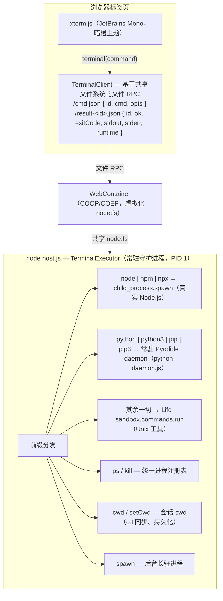

# Succinix

[](../LICENSE)
[](../package.json)
[](https://github.com/CJackHwang/Succinix/actions/workflows/ci.yml)
[](../CONTRIBUTING.md)

> 语言：[English](../README.md) | **简体中文**

**一个浏览器原生的 Linux：由 WebContainer + Lifo 驱动的全屏 Unix 终端，通过统一的 TerminalExecutor 把 `node|npm|npx` 路由到真实 Node.js 运行时，其余命令路由到 Lifo Unix 用户态——两者共享同一个文件系统。**

打开一个浏览器标签页，启动进入类 Linux 环境，无需安装任何东西即可使用 Unix 工具、Node.js、进程管理、端口转发和 Postgres 数据库（tinbase）。

---

## 特性

- **全屏终端体验** — 居中的 DOM 启动画面（boot splash）带系统自检与环境不适配优雅退出（显示专业错误页而非降级），随后进入交互式 Shell（`guest@succinix:~$`）。
- **交互终端按键（REPL）** — **Ctrl+C** 中断当前运行命令并丢弃排队命令（`node`/`npm`/`npx` run 经 `interrupt` 协议被 kill；纯 Lifo 命令与后台服务不受影响）、**上下箭头**浏览命令历史（会话内存）、**Tab** 补全内置命令名与文件路径（多候选列出）、**Ctrl+L** 清屏。提示符随会话 cwd 更新：`cd /workspace/proj` 后 `guest@succinix:~$` 变为 `guest@succinix:~/proj$`（`~` = 工作区根）。
- **统一命令执行** — 单一终端入口：
  - `node`、`npm`、`npx` 及项目二进制运行在**真实 Node.js 进程**上（WebContainer）。
  - `python` / `python3` / `pip` / `pip3` 运行在**内置 Pyodide 运行时**（Python 3.14.2，Pyodide 314.0.4）——常驻 daemon 作为系统资产打包（零安装、用户 `npm install` 无法装坏），首用懒注入。支持 `python -c "<code>"` 与 `python <script.py>`；`pip` 映射到 Pyodide 的 **micropip**（纯 Python wheel 经 `/.pyodide/site-packages` 刷新后仍在）；交互式 REPL 不支持（WebContainer stdin 边界）。
  - 其余一切（`grep`、`sed`、`awk`、`cat`、`tar`、`curl`、管道、重定向……）运行在 **Lifo**——一个 TypeScript 实现的 Unix 用户态。
- **会话工作目录（融合基石）** — Lifo 里的 `cd` 现在驱动 host 维护的**会话 cwd**（持久化到 `/etc/succinix.cwd`，刷新恢复），并应用到每个真实 Node/Python 子进程（`spawn cwd`）。`pwd` 显示会话 cwd，`node`/`python` 看到同一目录——不再有 `cd /ws/proj && npm install` 装到容器根的问题。`cd /` 回到工作区根（`~`）；`cd` 到不存在目录时会话 cwd 不变。`lang` 列出内置运行时与版本。（TASK24：`/workspace` 是 Lifo 挂载视图，真实容器 FS 没有该路径；node/python 子进程实际 spawn 在映射后的 host 真实目录，子进程里 `process.cwd()` 报真实路径如 `/home/<wc-id>/proj`，`pwd`/`cwd` 仍显示 Lifo 视角 `/workspace/...`。）
- **共享文件系统** — 浏览器（`wc.fs`）与 Lifo 命令操作的是**同一份文件**。无需桥接代码：WebContainer 为进程虚拟化 `node:fs`，Lifo 通过 `NativeFsProvider` 消费它。
- **进程管理** — 统一进程表上的 `ps` / `kill`（真实子进程 + 状态跟踪），含后台 `spawn`。每个 `ps` 条目带 `scope` 字段（`system` / `container` / `unknown`，`container` 时附 `containerId`）——**启发式判定**（命令串 + 进程启动 cwd，`cd /workspace/c-<id> && ...` 前缀），仅用于 **UI 展示与查询过滤，不是安全边界**：用户进程只要命令长得像系统进程（如 `node /usr/lib/succinix/fake.js`）就会被标为 `system`。不可作为权限 / 隔离 / kill 拦截的信任依据（见 [docs/PROTOCOL.zh-CN.md](PROTOCOL.zh-CN.md)）。
- **端口管理** — 通过 WebContainer `server-ready` 事件探测服务，`ports` 列出端口与预览 URL。
- **数据库** — `db start` 在容器内启动真实 Postgres（tinbase，PGlite/WASM 引擎）；`db status` / `db stop` 管理它。
- **持久化** — 工作区（文件、配置、env、settings、工作区）快照到 IndexedDB，boot 时恢复；刷新永不丢用户文件。`snapshot` 命令查看状态 / 手动保存 / 重置。快照以文本为主：二进制/不可读文件跳过（在保存日志中计数报告）；收集大小超过 ~50 MB 的快照跳过并告警而非写入（`snapshot now` 报告 `skipped (over 50MB limit)`）。tinbase 数据库存储（`.tinbase`，PGlite/WASM）整体排除——它是二进制的，纯文本的部分恢复会损坏它；因此 tinbase 数据在会话内跨 `db stop`/`db start` 持久，但**不**跨浏览器刷新（刷新重建全新 store）。
- **多实例内嵌（0.6.0+）** — `?instance=<id>` 以命名实例启动应用：状态文件、快照、服务/端口视图与进程视图按实例（`ps` 过滤、跨实例 `kill` 拒绝）。不同 id 的双 tab 完全隔离（独立 host + IndexedDB 键）。
- **多用户语义（0.6.0+）** — `?user=<id>`（`?instance=<id>` 的别名）额外种子每用户 home（`/workspace/users/<id>`）：会话在 home 内启动、提示符渲染为 `~`、`whoami` 显示用户，状态/快照/进程视图按用户。**组织性隔离，非安全边界**——无真实内核/权限模型；独立应用仍是 `guest` 单用户（见 AGENTS.zh-CN.md）。
- **内存管理** — `free` / `top` 提供内存概览（设备 + JS heap；沙箱估算诚实标注），`reboot` 以浏览器重载重启系统（持久化数据存活），`shutdown` 关机，`cache` / `cache clear` 报告与清理可重建缓存（绝不触碰 `/workspace`）。
- **工作区分拆** — `workspace` 管理多个隔离工作区：每个工作区在独立 `/ws/<name>` 目录，各有文件与状态；`create` / `switch` / `rm` 管理它们，当前工作区记录在 `/ws/.current`（跨刷新持久）。首次 boot 初始化默认 `main` 工作区。
- **系统配置** — `env` 管理持久环境变量（`/etc/succinix.env`，spawn 时合并进真实 Node 子进程）与 `settings` 管理持久系统设置（`/etc/succinix.settings`）：tinbase 端口（`preview-port`，默认 3001）、初始工作区（`default-workspace`，默认 `main`）、终端字号（`font-size`，实时生效）。两个文件随快照跨刷新持久。
- **服务管理** — `service` 在 `spawn`/`ps`/`kill` 与端口注册表之上声明式管理具名后台服务：定义在 `/etc/succinix.services`（`name|command|port`，`#` 注释，`${PORT}` 占位符从 `preview-port` 解析），`start`/`stop`/`status`/`enable`/`disable`。`enable` 记录服务到 `/etc/succinix.autostart`，boot 时声明式拉起——是声明式重启，不是守护进程（无崩溃自愈）。
- **系统日志（journald 风格）** — 持久日志写入容器 FS 的 `/var/log/succinix.log`（随快照跨刷新持久），格式 `2026-08-05T04:00:00Z [level] message`。采集 boot 事件（`BOOT`）、命令执行（`INFO` 含 `cmd`/`exit`/`runtime`）、服务事件（`INFO`/`WARN`）、快照事件（`INFO`）与错误（`ERROR`）。`log` 读取（`log` 最近 20 行、`log -n <count>` 最近 N 行、`log boot` 仅 BOOT、`log clear` 清空）；文件超 ~200 KB 自动截断保留尾部。交互式 `log -f`（tail -f）有意不实现（POC）。
- **包管理** — `pkg` 用 apt 风格接口统一两条真实包通道：**lifo**（`lifo list` / `lifo install` / `lifo remove` / `lifo search`——Lifo 扩展包如 `lifo-pkg-git`、`lifo-pkg-ffmpeg`）与 **npm**（真实 Node npm，全生态）。来源自动判定：`lifo-pkg-<name>` 在 npm 存在的包走 lifo 安装，否则走 npm；同名冲突 lifo 优先（工具包）。`pkg list` 合并两通道并带 `SOURCE` 列，`pkg search` 合并两个搜索，`pkg install`/`remove` 回显真实命令输出且绝不吞错。npm 已装列表只读 `node_modules` **顶层目录**（"顶层直装"简化——容器预装运行时依赖也会出现，不解析依赖树）。
- **虚拟网络视图** — `netstat` 把端口注册表渲染为虚拟监听端口表（`Proto  Local Address  State`，`tcp 127.0.0.1:<port> LISTEN`；`netstat -p` 附加关联进程，按进程命令中的端口号匹配，无匹配显示 `-`），`ip addr` 显示浏览器虚拟网络身份（`lo: virtual loopback`、`eth0: <preview-domain> (virtual)`）。一切诚实标注 `virtual`——不编造接口、IP 或连接。
- **系统信息与登录横幅** — `uname` 报告诚实的浏览器原生系统身份（`Succinix 0.6.0 js-runtime+webcontainer <api-version> <arch>`；内核标识 `js-runtime+webcontainer`，绝不冒充 Linux 内核；`-a` 追加主机名/OS，`-r` 是 `@webcontainer/api` 运行时版本，`-m` 是从 UA 提取的架构），`motd` 显示/编辑 `/etc/succinix.motd` 登录横幅（随快照持久；默认欢迎行每次 boot 打印，`motd reset` 恢复）。
- **自检模式** — `?test=1` 在浏览器中运行系统诊断自检。

## 架构



关键设计决策：**文件系统是唯一事实源。** 因为 WebContainer 通过 `node:fs` 把容器文件系统暴露给进程，而 Lifo 通过 `NativeFsProvider` 挂载 `process.cwd()`，浏览器、Node 进程与 Lifo 看到的是同一个文件系统。没有需要维护的文件系统桥。

## 快速开始

要求：现代 Chromium 系浏览器（Chrome/Edge）+ 跨源隔离（COOP/COEP 头）+ `SharedArrayBuffer` 支持。本地开发无需任何服务端基础设施。

```bash
npm install          # 安装依赖
npm run dev          # 启动 Vite dev server（COOP/COEP 头已预配置）
# 打开 http://localhost:7892
```

页面启动 Succinix：系统自检，然后进入 Shell 提示符。输入 `help` 查看可用命令。

### 构建与检查

```bash
npx tsc -p tsconfig.json --noEmit   # 类型检查（要求 0 错误）
node scripts/build-host.mjs         # 打包容器内 host（host.js）
npm run build                       # 生产构建
node scripts/verify-deploy.mjs      # 部署就绪门禁（build + preview + COOP/COEP + ?test=1）
```

### 测试

Succinix 有分层测试体系，本地与 CI（GitHub Actions）一致。测试未引入任何新运行时依赖——e2e 复用现有 CDP 脚本（`verify-deploy` / `bench` / `scenarios`），单测用 mock 文件系统 / IndexedDB / 网络。

- **Lint** — `npm run lint`（`eslint.config.js` flat config）。`typescript-eslint` recommended + 项目规则：禁 `any`（error）、无遗留 `console.log`（warn；`console.warn`/`error` 按降级日志约定允许，host 侧文件豁免）、无未用变量/导入。门禁：**0 error**。
- **Typecheck** — `npm run typecheck`（`tsc -p tsconfig.json --noEmit`）。门禁：**0 error**。
- **单测** — `npm run test`（Vitest，node 环境）覆盖纯逻辑模块 `src/log.ts`、`src/persist/index.ts`、`src/services/index.ts`、`src/pkg/index.ts`、`src/motd.ts`、`src/config.ts`、`src/engine/host-route.ts`、`src/engine/client.ts`（内存 mock，见 `tests/`）；`src/commands/index.ts` 纯函数（workspace/uname/netstat/端口匹配/label）也已单测。`npm run test:coverage` 追加 v8 覆盖率门禁：入禁文件 **≥70%** statements/branches/functions/lines。
- **测试模式 URL 是开发者钩子（P6-19）** — `?test=1`、`?bench=1`、`?scenario=1` **仅供测试**：它们会把内部句柄挂到 `window`（`__succinixResult` / `__succinixBench` / `__succinixScenario`，其中最后一个可驱动真实命令），**绝不可出现在生产链接中**。正常访问不带任何 query 参数，不暴露任何内部对象。
- **e2e** — `npm run test:e2e` 构建一次，然后在 headless Chrome 里对 `vite preview` 依次跑 CDP 脚本：
  1. `scripts/verify-deploy.mjs` — 部署就绪门禁 + `?test=1` 自检（门禁 **≥71 passed, 0 failed**）；
  2. `scripts/bench.mjs` — 性能基准（JSON 输出）；
  3. `scripts/scenarios.mjs` — 十四场景真实工作流套件（S1–S14；场景定义拆分在 `scripts/scenarios/`）；
  4. `scripts/lang-verify.mjs` — 语言生态验证套件（TASK25）；
  5. `scripts/instance-demo.mjs` — 多实例 + 多用户演示（双 tab，R3）；
  6. `scripts/instance-routing.mjs` — 同页多实例路由（R5）；
  7. `scripts/cordis-app-e2e.mjs` — 外部 `@succinix/engine` 消费者验证已发布 dsh-key 契约。
  有意不用 Playwright：CDP 脚本让流水线保持零依赖、与本地运行一致。
- **CI** — `.github/workflows/ci.yml` 每次 push/PR 跑 lint → typecheck → 单测（含覆盖率）→ build → `verify-deploy`（headless 自检）；完整 e2e 门禁在 `.github/workflows/e2e-full.yml`（源码/脚本变更触发，deploy gate 在已知 scenario flake 上重试一次）；定时 nightly job 跑重场景 `scenarios` + `lang-verify` + `instance-demo` 套件。见本文件顶部 CI 徽章。
- **pre-commit（可选，零依赖）** — `npm run setup:hooks` 写入 `.git/hooks/pre-commit`，对变更文件跑 `tsc --noEmit` 与 ESLint（`scripts/pre-commit.sh`）。**不强制**：跳过 `setup:hooks` 项目照常可提交。

### 依赖与审计

依赖策略：**只报告，不自动升级**（升级单独评估以避免回归）。TASK17 最终轮审计结果（2026-08-05）：

- `npm audit` → **0 漏洞**（全部直接/传递依赖干净）。
- `npm outdated` → 仅 **`@lifo-sh/core` 0.10.8 → 0.10.9** 有新版本；其余全部最新。不升级（策略），待单独评估。
- `public/host.js` 经 esbuild 压缩（`scripts/build-host.mjs` 中 `minify: true`）；host 守护进程保持轻量（约 16.5 KB），`@lifo-sh/core` 单独打包为 `public/lifo-core.js`（约 1 MB），在首个 Lifo 命令时懒加载。采用纯 `minify`，因为完整 `?test=1` 套件对压缩产物通过（Lifo 无依赖 `Function.name` 的会被名称压缩破坏的地方）。

### 自检模式

```bash
# 打开 http://localhost:7892/?test=1
```

在居中的启动画面覆盖层里跑完整诊断套件（文件系统、路由、进程生命周期、端口、配置、服务、日志、包、冒烟），随后把汇总打印进终端并进入 Shell。

### 部署（Vercel）

Succinix 是**纯静态站**（Vite → `dist/`）：无后端、无服务端状态——工作区、文件、配置与设置存在浏览器 IndexedDB 并随快照（tinbase 数据库存储排除；见持久化）。任何能发送自定义响应头的静态托管都可部署；一键路径是 Vercel。

**为什么 COOP/COEP 关键。** WebContainer 要求跨源隔离。没有 `Cross-Origin-Opener-Policy: same-origin` 与 `Cross-Origin-Embedder-Policy: credentialless` 头，页面环境检查失败并显示错误页而非终端。`vercel.json` 为**每个**路径（含 `assets/*` 与 `host.js`）下发这些头，与 dev/preview server 一致。漏掉它们是部署时"白屏 + 环境错误页"的头号原因。

**一键部署（Vercel）：**

1. 把仓库推到 GitHub / GitLab / Bitbucket。
2. Vercel dashboard 里 **Import Project** → 选仓库。Vercel 自动识别 Vite（`vercel.json` 里的 `framework: vite`、`buildCommand: npm run build`、`outputDirectory: dist`）。
3. 部署。可选添加自定义域名，如 `succinix.alibicore.com` 或 `cjack.me` 子域。

CLI 等价操作（需要 Vercel 账号/token）：

```bash
npm i -g vercel
vercel login
vercel --prod
```

**本地部署就绪验证**（无需 Vercel token）。`vite preview` 以与 Vercel 相同的方式服务构建好的 `dist/`，所以这就是"静态产物可部署"的证明：

```bash
npm run build
node scripts/verify-deploy.mjs
# 启动 vite preview，断言 /、/host.js 与 JS bundle 的 COOP/COEP，
# 再在 headless Chrome 里跑 ?test=1 —— PASSED 要求 >=71 passed 且 0 failed
```

**数据分域。** IndexedDB 按 **origin** 隔离。更换部署域名 = 启动全新系统：工作区、文件与数据库数据**不**跨域迁移。同域刷新安全（快照恢复）；只有换域会重置系统。这也适用于 Vercel preview 部署：每个 preview 有独立 URL（不同 origin），每个 preview 环境有各自分域的 IndexedDB——preview 部署之间数据也不互通。

## 用法

### 内置命令（浏览器侧处理）

| 命令 | 说明 |
| ---- | ---- |
| `help` | 显示命令帮助 |
| `clear` | 清屏（`Ctrl+L` 也可） |
| `sysinfo` | 显示浏览器检测的系统信息 |
| `ports` | 列出就绪服务端口与预览 URL |
| `db start` | 启动 tinbase 数据库（缺失时自动安装） |
| `db status` | 显示数据库状态（端口注册表 + 进程表） |
| `db stop` | 停止数据库 |
| `version` | 显示版本 |
| `whoami` | 显示当前用户（`guest`；`?user=` 模式显示用户 id） |
| `snapshot` | 持久化状态；`snapshot now` 保存、`snapshot clear --yes` 重置 |
| `free` | 显示内存概览（设备 + JS heap；沙箱估算标 `~`） |
| `top` | 实时进程表——间隔 2s 共 3 次快照后退出 |
| `reboot` | 重启 Succinix（浏览器重载；持久化数据存活） |
| `shutdown` | 关机（可关闭本标签页） |
| `cache` | 显示缓存占用；`cache clear` 清理可重建缓存 |
| `workspace` | 列出工作区；`create` / `switch` / `rm` 管理隔离工作区 |
| `env` | 列出 / 设置（`env KEY=value`）/ 删除（`env -u KEY`）环境变量，持久于 `/etc/succinix.env` |
| `settings` | 查看 / 设置 / 重置（`settings reset KEY`）系统设置，持久于 `/etc/succinix.settings` |
| `service` | 列出服务（状态 + 端口）；`start` / `stop` / `status` / `enable` / `disable <name>` 管理。定义在 `/etc/succinix.services`，boot 自启在 `/etc/succinix.autostart`（声明式重启，非守护进程） |
| `log` | 显示 `/var/log/succinix.log` 最近系统日志（20 行）；`log -n <count>` 最近 N 行、`log boot` 仅 BOOT、`log clear` 清空 |
| `pkg` | 包管理：`pkg list`（lifo + npm 合并带 `SOURCE`）、`pkg search <term>`（双通道）、`pkg install <name>`（`lifo-pkg-<name>` 存在走 lifo，否则 npm）、`pkg remove <name>`（按安装来源）、`pkg info <name>` |
| `netstat` | 列出虚拟监听端口（端口注册表为 `tcp 127.0.0.1:<port> LISTEN`）；`netstat -p` 附加关联进程（按进程命令中的端口号匹配，无匹配 `-`） |
| `ip addr` | 显示虚拟网络身份——`lo: virtual loopback`、`eth0: <preview-domain> (virtual)`；不编造接口或 IP |
| `uname` | 显示系统身份：汇总行（`Succinix <version> js-runtime+webcontainer <api-version> <arch>`）；`uname -a` 全字段、`-r` 运行时版本、`-m` 架构（UA 提取，缺失 `unknown`） |
| `motd` | 查看登录横幅（`/etc/succinix.motd`）；`motd <text>` 设置（持久）、`motd reset` 恢复默认 |

### Host 命令（TerminalExecutor，统一路由）

| 命令 | 路由 | 说明 |
| ---- | ---- | ---- |
| `node ...` / `npm ...` / `npx ...` | Node | 真实 Node.js 子进程；命令含 **shell 元字符**（`&&`、`\|`、`>`、`2>&1`……）时整条链经 **Lifo shell** 执行（管道/链/重定向由 shell 层解析，各 node/npm/npx 段再转回真二进制），结果 `runtime=lifo` |
| `grep`、`cat`、`tar`、`curl`、…… | Lifo | Unix 工具、管道、重定向 |
| `ps` | — | 列出统一进程表 |
| `kill <pid>` | — | 终止进程（SIGTERM） |
| `cwd` / `ping` / `exit` | — | 协议命令 |

## 已验证行为

浏览器运行时验证套件结果（见 `src/selftest/index.ts`）：**76 passed, 0 failed, 5 skipped**（2026-08-10 轮，针对压缩 host bundle；语言生态检查含扩展标准库 import、共享 FS 读写、micropip、`npm i -g` EACCES hint）。5 个 skip 是已知边界（外部网络、symlink 回退、设备内存统计），绝非静默失败。`?test=1` 模式下汇总行与失败列表（若有）在 boot 覆盖层淡出后额外打印到终端（自检结果保持可见）。

- 共享文件系统：浏览器 → Lifo 与 Lifo → 浏览器读写均工作。
- 路由：`node -e "console.log(21*2)"` → `42`（`runtime=node`）；`npm --version` → 真实 npm 版本；`grep`/`cat`/`wc` → `runtime=lifo`。
- Shell 融合（TASK24）：node 系命令含 shell 元字符时回退 Lifo shell —— `node -e "console.log(21*2)" | grep 42` → `42`（`runtime=lifo`），`node --version && npm --version` → 两行真实版本；链内各 node/npm/npx 段转回真二进制（非浏览器内 JS 解释器）。`node -e` 转义引号保真（`node -e "console.log(\"hi\")"` → `hi`）；未闭合引号报 `unterminated quote in command` 而非静默截断。
- 进程生命周期：`spawn` 后台服务 → `ps` 可见 → `kill` 转 `exited`。
- 端口注册表：`server-ready` 事件暴露预览 URL。
- 数据库：tinbase（PGlite/WASM）启动并服务。
- 内存：浏览器报告的设备内存 / JS heap 统计（`free` 可渲染）。
- 配置：`env` 设置/获取/删除生命周期与 `settings` 写/重置持久到 `/etc/succinix.*`。
- 服务：`service` 列出内置 tinbase 定义；临时 echo server 可启动、观察 `running`（进程表 + 端口注册表）、停止、零残留删除；`service enable`/`disable` 写入与移除 `/etc/succinix.autostart` 文件（去重）。
- 日志：命令执行记录含 `exit`/`runtime`，boot 事件记录为 `BOOT` 条目，`log clear` 清空日志文件（自检断言）。
- 包：`pkg list` 渲染双通道表（NAME / SOURCE / VERSION）；`pkg search git` 命中 `lifo-pkg-git`（依赖网络——失败按已知边界约定跳过）。
- 网络视图：`netstat` 把端口注册表渲染为虚拟监听端口表，`netstat -p` 关联 spawn 的 echo server（端口 3456）与进程；`kill` 后端口从表消失。`ip addr` 打印虚拟回环与预览域，诚实标注 `(virtual)`。
- 系统信息：`uname` 渲染诚实的系统行（`Succinix <version> js-runtime+webcontainer <api-version> <arch>`）与 `-a`/`-r`/`-m` 形态；`-r`/`-m` 参数解析额外经命令分发路径断言（不只 builder）。`motd` 设置 → 读回 → 重置使 `/etc/succinix.motd` 回到默认（零残留）。
- 冒烟：全部 25 个安全内置命令（help/clear/sysinfo/version/whoami/ports/pwd/lang/db status/db stop/snapshot/free/top/cache/workspace/env/settings/service/log/pkg/netstat/ip addr/uname -a/motd/shutdown）经浏览器处理器分发无错误；`reboot` 与 `db start` 排除在自动化冒烟外（破坏性/重副作用）。
- 语言生态（TASK27）：`python -c "print(6*7)"` → `42`（内置 **Pyodide 314.0.4**，Python 3.14.2）；完整标准库 import 矩阵（json/csv/re/math/os/sqlite3/subprocess/collections/datetime/hashlib/urllib）全绿且扩展标准库进入自检；`python3 --version` 报 Python 3.14.2；python 读写共享 FS（浏览器 + node 读到同一文件）；`python -m pip install pyparsing` → import 可用（micropip）。权威、以实测为准的矩阵见 **[docs/LANGUAGES.zh-CN.md](LANGUAGES.zh-CN.md)**（英文 **[docs/LANGUAGES.md](LANGUAGES.md)**）。
- 语言防回归（TASK25，场景 S14）：用户实测 5 坑逐条锁定 —— `node --version && npm --version` 链、`node -e` 嵌套引号写文件（穿透 tsc）、`npm i -g` EACCES + hint、cd 同步装包（进项目目录非根 node_modules）、python 真管道。
- 稳定性：RPC 客户端在单槽 `/cmd.json` 通道上串行化请求（无并行通道竞态），只读命令（ping/ps/cwd）传输失败重试一次，浏览器看门狗连续 2 次 ping 失败后重注入 + 重拉 `host.js`。

## 语言

Succinix 内置两个**语言运行时**（系统资产、零用户安装），并可执行预编译 WASI 模块；下列每项
都以 `scripts/lang-verify.mjs`（真实浏览器执行）**实测为准** —— 权威矩阵见
**[docs/LANGUAGES.zh-CN.md](LANGUAGES.zh-CN.md)**（英文 **[docs/LANGUAGES.md](LANGUAGES.md)**）。

| 语言 | 命令 | 状态 | 关键实测事实 |
| ---- | ---- | ---- | ----------- |
| **Python** | `python` / `python3` / `pip` / `pip3` | ✅ 内置 | 3.14.2 Pyodide 314.0.4；11/11 标准库 import；sqlite3/json 真实可用；**pip 经 micropip**（纯 Python wheel 刷新后仍在；编译 wheel 刷新后需重装）、无 REPL、subprocess 可导入但无法 spawn |
| **Node.js** | `node` | ✅ 内置 | 22.22.3；真实二进制；`node -e` 引号保真；完整 TS 工具链（typescript/tsx/vitest） |
| **npm** | `npm` | ✅ 内置 | 10.8.2；本地装进会话 cwd；全局 → EACCES + hint |
| **TypeScript** | `npx tsc` / `tsx` | ✅ 经 npm | tsc → node → vitest 全闭环（S13/S14） |
| **Ruby** | — | ⚠️ 仅探测 | `@ruby/wasm-wasi` v2 容器内可跑（`6*7` → 42）；未集成 |
| **C / Rust / Go** | — | ❌ 缺失 | 无编译器（`which gcc/rustc/go` → not found） |
| **WASI** | `node:wasi` | ✅ | 预编译 WASI 模块可经 `node:wasi` 运行 |

## 已知边界

这些是环境约束，不是 bug：

- **CORS**：对无 CORS 头的网站 `curl` 失败（`exit 7`）。用 CORS 友好代理，如 `curl https://r.jina.ai/<url>`。
- **Symlink**：Lifo VFS 不支持（`ln` 报告限制）。
- **无包管理器 / 原生二进制**：没有 `apt`；原生可执行文件无法运行。Succinix 是浏览器原生 Linux。
- **交互进程的 stdin**：WebContainer 环境不可靠；设计改用基于文件的 RPC。
- **跨运行时流式管道**：跨运行时管道是缓冲的（对 agent 式"跑完再读"工作流足够）。
- **`/workspace` 是 Lifo VFS 视图；真实 node/python 子进程看到真实路径**：浏览器文件系统根（`wc.fs` `/`）与 Lifo 的 `/workspace` 都映射到 host 进程 cwd（`/home/<wc-id>`），而容器根 `/` 是只读系统视图。`pwd`/`cwd` 报 Lifo 视角（`/workspace/...`），node/python 子进程里的 `process.cwd()` 报真实映射路径（`/home/<wc-id>/...`）——指向同一目录。
- **`npm i -g` 到只读 `/usr/local` 会追加可操作提示**：`hint: /usr/local is read-only for guest. Install locally: npm i <pkg>  (or set a user prefix: npm config set prefix ~/.npm-global)`（权限语义不变）。
- **Python REPL 未实现**：内置 python 运行时面向命令（`python -c "<code>"`、`python <script.py>`、`python -m pip <cmd>`）。交互式 `>>>` REPL 需要持久 stdin，WebContainer 不可靠 —— 请用 `python -c`。`pip` **可用**（Pyodide 的 **micropip**；纯 Python wheel 经 `/.pyodide/site-packages` 刷新后仍在；编译 wheel 如 `numpy` 刷新后需再 `pip install <pkg>`——文本快照不带二进制 `.so`）。`python -m <module>` 经 `runpy.run_module` 执行（仅 `-m pip` 特殊映射）；`subprocess` 可导入但无法 spawn——Pyodide 抛 `OSError: [Errno 138] emscripten does not support processes`（见 [docs/LANGUAGES.zh-CN.md](LANGUAGES.zh-CN.md)）。
- **首次 `python` 命令慢**：Pyodide 运行时（~13 MB JS + wasm + stdlib）首用懒注入容器，且常驻 daemon 首次 `loadPyodide` 需一次性初始化，首个 `python` 命令需数秒；后续命令复用实例、快。它是系统资产、不依赖用户 `npm install`，不会被用户操作装坏。
- **看门狗探针可能被排队命令吞掉**：host 存活看门狗向单槽 `/cmd.json` 通道写直接 `ping` 探针；若用户命令在 ~120 ms host 轮询窗口内入队会覆盖探针，该探针超时、看门狗跳过该轮（中性，不算失败）。这只是在罕见重叠时把存活检测推迟一个 30s 周期；不会误杀健康 host。
- **单命令输出上限 1 MB**：为约束容器内存与结果文件大小，每条命令 `stdout`/`stderr` 最多保留最后 ~1 MB（大输出截断到尾部）。正常使用（`seq 1 5000`、中等文件 `cat`、`npm install` 日志）远低于上限。
- **快照去重对等长内容编辑盲（有界窗口）**：自动快照按目录结构 + 总字节去重，因此「内容变但大小不变」的编辑（如 `sed -i 's/foo/bar/'` 且 `foo`/`bar` 等长、或 `vi` 原地覆盖）不被结构门控察觉。浏览器侧写入（`env`/`settings`/`motd`/`workspace switch`/服务文件）会立即强制保存，安全。经 shell（Lifo/node）的编辑由自动快照的 **30s 最大年龄强制**兜底：即使签名不变，每隔 ~30s 也会强制全量保存一次，等长编辑只要发生在崩溃前 30s 以上就能保留。残余丢失窗口：等长 shell 编辑发生在最近 ~30s 内且 tab 恰好崩溃且无 `pagehide`/`beforeunload`（OOM 杀、OS 回收）。
- **声明式自启（非守护进程）**：`service enable` 只记录服务供 boot 重启。无崩溃检测或自愈——服务 boot 后退出请手动重启（`service start <name>`）。
- **`log -f`（tail -f）未实现**：交互式流式输出延后（POC；WebContainer 中交互 stdin 不可靠）。用 `log` / `log -n <count>`。`log clear` 清空 `/var/log/succinix.log` 因此自身不记录进日志。
- **日志追加是读改写（backlog）**：WebContainer `FileSystemAPI` 无 `appendFile`，每次 `log` 写入 = 读整个 `/var/log/succinix.log` + 拼一行 + 写回——每条 O(文件大小)。在 ~200 KB 自动截断上限内 POC 可接受；backlog 项（P4-14）是上游提供 appendFile 时切真追加、或改分片文件。这是日志系统在高命令量时最先扛不住的部位。
- **外部入站网络**：服务经虚拟预览 URL 可达，公网不可达。
- **服务按命令串认领进程**：`service stop`（与 `db stop`）按渲染命令匹配进程表定位服务，而非 PID 血缘。手动启动的同命令进程可能被匹配并终止。`service start` 同理，找到同命令进程即报 "already running"。
- **内置 tinbase 服务需一次安装步骤**：预置 `service` 定义（`tinbase`）跑 `npx tinbase start --port ${PORT} --engine wasm`，要求容器内已装 tinbase。先跑一次 `db start` 完成容器内安装，再 `service start tinbase`。
- **lifo 包会话级；npm 包持久**：`lifo install` 把包放进 Lifo 运行时的内存全局模块目录，因此只存在于当前 host 会话，host 重启重建（完整刷新启动全新 Lifo 内核）。npm 包装进共享文件系统的 `/node_modules` 并随工作区快照持久。`pkg list` 合并两者；来源规则"`lifo-pkg-<name>` 在 npm 存在走 lifo，否则 npm；同名冲突 lifo 优先"。
- **`pkg` 安装需要 registry 访问**：`pkg install`/`search`/`info` 访问 npm registry（经 `lifo search` / 真实 npm）。registry 不可达时命令报告原因，不假装成功。
- **多用户仅为组织性隔离、无权限位**：独立应用仍是单用户（`guest` 是唯一用户；`?user=<id>`/`?instance=<id>` 嵌入模式按用户/实例分割目录、状态与进程视图——**非安全边界**，无真实内核/权限模型）。权限位管理（`chmod` 语义）不模拟——模拟模式无真实价值。
- **仅 Chromium**：WebContainers 要求 Chromium 系浏览器（Chrome/Edge）。Firefox、Safari 与移动浏览器不支持；环境检查错误页说明要求而非降级。
- **部署宿主必须能发自定义响应头**：WebContainer 的跨源隔离要求 `vercel.json` 里配置的 COOP/COEP 头。不能设置自定义响应头的托管（如某些对象存储/CDN 静态托管）无法运行 Succinix。Vercel 免费版经 `vercel.json` 支持自定义头。
- **无 Content-Security-Policy 响应头（已评估、暂缓）**：当前不发送 CSP。WebContainer 内部需要 `worker-src blob:`（worker 引导）、带 `wasm-unsafe-eval` 的 `script-src`（Lifo/Pyodide）、以及指向 npm registry / Pyodide CDN 的 `connect-src`；严格 CSP 有破坏运行时的风险。已评估并有意暂缓而非未验证强上（P6-18）——启用前需经 `?test=1` + `verify-deploy` 一轮验证。

## 项目结构

```
src/
  main.ts            # 入口：Cordis host 装配（xterm、REPL、boot 编排）
  boot-steps.ts      # 启动序列、系统信息检测、环境预检
  boot-ui.ts         # 居中 DOM 启动覆盖层渲染器（splash/日志/环境失败页）
  app/               # xterm 装配、输出、本地命令、日志、自动快照、看门狗、dev hooks
  host/              # app 级 Cordis 插件（terminal/commands/snapshot/watchdog/selftest/container）
  commands/          # 浏览器侧命令（help/ports/db/free/top/cache/workspace/env/settings/service/log/pkg/netstat/ip/...）
  config.ts          # 系统配置：/etc/succinix.env + /etc/succinix.settings 读写与默认值
  motd.ts            # 登录横幅：/etc/succinix.motd 读写与默认
  services/          # 服务管理：/etc/succinix.services + /etc/succinix.autostart 读写、状态/启动/停止
  log.ts             # journald 风格系统日志：/var/log/succinix.log 追加/读取/清空/BOOT 过滤
  pkg/               # 包管理：pkg list/search/install/remove/info（lifo + npm 双通道）
  persist/           # 快照持久化：排除规则/收集/签名/IndexedDB
  selftest/          # 自检套件（?test=1）：runner + 各域测试（kernel/filesystem/persistence/config/services/packages/process/network/info/languages/smoke）
  engine/            # TerminalExecutor 引擎——已解耦、可复用（见生态）
    index.ts         # 内部核心 barrel，供 src/plugin 使用（不对外导出）
    client.ts        # 文件 RPC 客户端，TerminalClient（原 terminal-client.ts）
    host/            # host 守护进程域：config/rpc/run/spawn/ps-kill/main（O3 拆分）
    host-route.ts    # host 纯逻辑：路由 / 路径映射 / 按实例过滤 + kill 授权
    host-procs.ts    # 统一进程注册表（原 host-procs.ts）
    lifo-core.ts     # 懒加载 @lifo-sh/core 内核入口（打包为 public/lifo-core.js）
  terminal/          # 终端核心，由 host terminal facade 消费（无 ./terminal 导出）
  instance/          # 实例工厂，由 host.ensureInstance 消费（无 ./instance 导出）
  plugin/            # dsh Cordis 插件入口：服务、生命周期、事件、能力、HostManager
scripts/
  build-host.mjs     # esbuild 打包容器内 host（host.js + 懒加载 lifo-core.js）
  build-engine-package.mjs  # 构建可发布的 @succinix/engine 包（packages/engine/，不 publish）
  verify-deploy.mjs  # 部署就绪门禁：build + preview + COOP/COEP + ?test=1 自检
  verify-bootgate.mjs  # boot 门禁验证：boot 期间输入无效、boot 日志按 N/M 步计数（CDP）
  bench.mjs          # headless Chrome 性能基准（JSON 输出）
  scenarios.mjs      # 十四场景真实工作流套件（headless Chrome + CDP；S14 = 语言防回归）
  scenarios/         # 场景定义按套件拆分：smoke / services / filesystem / kernel / languages（O11）
  lang-verify.mjs    # 语言生态验证（TASK25；真实浏览器执行）
  instance-demo.mjs  # 多实例 + 多用户演示（双 tab，R3）
  instance-routing.mjs  # 同页多实例路由（R5）
  cordis-app-e2e.mjs # 外部 @succinix/engine 消费者验证已发布契约
  run-e2e.mjs        # npm run test:e2e：构建一次 + 依次跑上面 7 个 CDP 步骤
  check-plugin-boundaries.mjs  # 插件边界门禁：engine/terminal/instance 保持 Cordis-free
  check-dsh-shapes.mjs  # dsh shape 门禁：vendored dsh 表面 vs src/plugin/dsh-types.ts
  check-dsh-keys.mjs   # 旧 key 门禁：allowlist 之外禁止 ctx.succinix* 残留 token
  pre-commit.sh      # 可选 pre-commit：变更文件跑 tsc + eslint（零依赖）
  setup-hooks.mjs    # npm run setup:hooks：把 .git/hooks/pre-commit 接到 pre-commit.sh
tests/
  log.test.ts        # src/log.ts 的 Vitest 单测（mock FS）
  persist.test.ts    # ... src/persist/index.ts（排除/签名/force/空目录，mock FS + fake IDB）
  services.test.ts   # ... src/services/index.ts（解析/端口渲染/状态，mock client）
  pkg.test.ts        # ... src/pkg/index.ts（来源判定/命令构造，mock 网络）
  motd.test.ts       # ... src/motd.ts
  config.test.ts     # ... src/config.ts
  helpers/fakes.ts   # 内存 FileSystemAPI / fake IndexedDB / 可脚本化终端客户端
eslint.config.js     # ESLint flat config（typescript-eslint recommended + 项目规则）
vitest.config.ts     # Vitest 配置 + v8 覆盖率门禁（核心纯逻辑模块 >=70%）
.github/workflows/
  ci.yml             # CI：lint → typecheck → 单测（覆盖率）→ build → verify-deploy；nightly 场景
  e2e-full.yml       # 完整 e2e 门禁：verify-deploy/bench/scenarios/lang-verify/instance-demo/instance-routing/cordis-app
public/
  host.js            # 轻量容器内 host 守护进程（生成物）
  lifo-core.js       # @lifo-sh/core 内核 bundle，host.js 懒加载（生成物）
```

## 生态

Succinix 的命令执行引擎**与 Succinix 应用本身解耦**，并以
**`@succinix/engine@0.6.0`** 作为面向 `@deepseek-ai/cordis@4.0.1` 的单个
Cordis 插件发布。没有独立 SDK API 线：消费方应用插件，然后使用 dsh 服务
`ctx.fs`、`ctx.sandbox`、`ctx.terminals` 与 `ctx.sessionPersistence`。
使用方页面启动 WebContainer，即得共享文件系统的 Shell——带真实 Node 运行时
（`node|npm|npx`）、内置 Pyodide Python 与 Lifo Unix 用户态（其余一切）——
无需自己构建任何部分。

```ts
import { Context } from '@deepseek-ai/cordis';
import engine from '@succinix/engine';

const ctx = new Context();
const fiber = ctx.plugin(engine, {
  container: { mode: 'external' },
  defaultInstance: { instanceId: 'default' },
});
await fiber;

const host = ctx.get('succinix-host', false)!;
await host.boot();
await host.ensureInstance('default', { executor: {} });

// ctx.fs、ctx.sandbox、ctx.terminals、ctx.sessionPersistence 全部可用；
// host.executor、host.terminal、host.snapshot、host.ports、host.services
// 位于内部 succinix-host seam 之后。
```

### dsh 插件 API

| 服务 | 作用 |
| --- | --- |
| `ctx.fs` | dsh 文件系统：12 原语、13 个 `FS_*` 错误码、`sandboxMode` |
| `ctx.sandbox` | dsh sandbox provider：同步 `confine`、node fail-closed |
| `ctx.terminals` | dsh owner 隔离 PTY registry（精确 `Agent` owner） |
| `ctx.sessionPersistence` | dsh event-sourced JSONL session log |
| `host`（`succinix-host`） | 内部生命周期 seam：`boot` / `attach` / `ensureInstance`、`executor`、`terminal`、`snapshot`、`persist`、`workspace`、`ports`、`services`、`capabilities`、`dispose` / `shutdown` |

消费方声明 `inject: ['fs', 'sandbox', 'terminals', 'sessionPersistence']`，
或用 `ctx.get('fs', false)` 探测。发布物 `.d.ts` 会增强
`Context['fs']`、`Context['sandbox']`、`Context['terminals']`、
`Context['sessionPersistence']` 与 `succinix/*` 事件表。

### 协议与集成文档

- **[docs/PROTOCOL.md](PROTOCOL.md)** — 权威文件 RPC 线上契约：请求/响应形态、命令路由、进程模型、端口事件、超时。
- **[docs/SDK.zh-CN.md](SDK.zh-CN.md)** — 0.6.0 dsh Cordis 插件集成参考：安装、配置、dsh 服务、host seam、能力、生命周期、热重载、容器模式。
- **[docs/PLUGIN.md](PLUGIN.md)** — 第三方 Cordis 插件如何消费/扩展 Succinix。
- **[docs/cordis-contract.md](cordis-contract.md)** — 权威契约快照与浏览器验证。
- **[docs/MIGRATION.md](MIGRATION.md)** — 0.4.0 独立 SDK 与 0.5.0 单键形态迁移指南。
- **[docs/LANGUAGES.zh-CN.md](LANGUAGES.zh-CN.md)** — 以实测为准的语言支持矩阵。

### 愿景

引擎与驱动 Succinix 终端的代码是同一份，只隔一道干净 Cordis 边界：核心逻辑
保持 Cordis-free、线上协议有文档、无应用层依赖泄漏进 `src/engine/`。任何已启动
WebContainer 的 Chromium 前端，都能通过应用 `@succinix/engine` 添加一个共享
自己文件的 dsh 执行世界。

## 开发档案

`docs/tasks/TASK*.md` 记录本项目的增量开发历史（每个任务的规格、保留项与质量门禁）。保留在仓库中作为**历史开发档案**，不属于交付产品。

## 文档索引

- **功能与能力清单** — [英文](FEATURES.md) · [简体中文](FEATURES.zh-CN.md)
- **语言支持矩阵** — [英文](LANGUAGES.md) · [简体中文](LANGUAGES.zh-CN.md)
- **文件 RPC 协议** — [英文](PROTOCOL.md) · [简体中文](PROTOCOL.zh-CN.md)
- **SDK / 插件集成** — [英文](SDK.md) · [简体中文](SDK.zh-CN.md)
- **Cordis 插件接入** — [英文](PLUGIN.md)
- **迁移指南** — [英文](MIGRATION.md)
- **契约快照** — [英文](cordis-contract.md)
- **Agent 与设计规范** — [英文](../AGENTS.md) · [简体中文](../AGENTS.zh-CN.md)
- **更新日志** — [英文](../CHANGELOG.md) · [简体中文](../CHANGELOG.zh-CN.md)
- **参与贡献** — [英文](../CONTRIBUTING.md) · [简体中文](../CONTRIBUTING.zh-CN.md)

## 路线图

- [x] POC：Lifo 运行在 WebContainer 内 + 共享文件系统
- [x] TerminalExecutor v1：统一路由 + 进程表
- [x] 产品外壳：全屏终端、启动序列、端口、tinbase
- [x] 生产级界面：英文 UI、暗橙主题、JetBrains Mono、系统自检
- [x] 启动画面：居中 DOM 覆盖层、响应式布局、环境不适配优雅退出
- [x] 持久化层：文件/状态持久到 IndexedDB，boot 恢复（刷新不丢数据）
- [x] 内存管理：`free`/`top` 类命令、缓存清理、reboot 回收内存
- [x] 工作区分拆：多虚拟目录隔离状态（类似 Sunam 工作区）
- [x] 虚拟网络视图：`netstat` 虚拟监听端口表 + `ip addr` 诚实虚拟身份
- [x] dsh 单轨引擎：`@succinix/engine@0.6.0` + `ctx.fs` / `ctx.sandbox` / `ctx.terminals` / `ctx.sessionPersistence`
- [ ] SunamAI 集成：`shell_run` 引擎换 TerminalExecutor——**暂缓**（计划为 TASK8；未排期）
- [ ] 可选：外部访问 WebSocket 隧道

## 许可

MIT © 2026 [CJackHwang](https://github.com/CJackHwang)。见 [LICENSE](../LICENSE)。

## 致谢

- [Lifo](https://github.com/lifo-sh) — TypeScript Unix 用户态（MIT）。
- [WebContainers](https://webcontainers.io) by StackBlitz — 浏览器里的 Node.js 运行时。
- [xterm.js](https://xtermjs.org/) — 终端模拟（MIT）。
- [tinbase](https://github.com/tinbase/tinbase) — 浏览器 Postgres（PGlite/WASM）。
- [Vite](https://vitejs.dev/) — 构建工具（MIT）。
